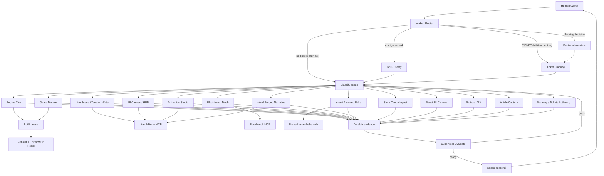

# Agent Work Graph

Status: active

Graph-engineering map for this checkout: specialized **roles** with clean contracts, durable handoffs, and shared-resource locks. Roles are routing contracts — they do **not** automatically spawn subagents. See [content-vs-engine-workflows.md](content-vs-engine-workflows.md) for C++ vs MCP target classification.

## Principles

1. **Partition by cohesion.** Keep tightly coupled lifecycle work in one executor (e.g. Animation Studio keys → `save_override` → seek → screenshot). Fan out only when the cut is sparse.
2. **Durable edges, not chat memory.** Handoffs are ticket IDs, stubs (`What changed`), plan JSON, suite names, screenshot paths, and git diffs.
3. **Shared locks are first-class nodes.** Rebuild lease ([agent-build-coordination.md](../features/agent-build-coordination.md)) and live editor+MCP session are contended resources — parallel agents must not both own them.
4. **Supervisor is outside the executor.** Evaluation uses a **fresh chat and a different model** than the executor ([`skills/evaluate`](../../skills/evaluate/SKILL.md)). Same-model self-grade is treated as grading your own work — not sufficient for the supervisor edge.
5. **MCP owns live surfaces.** Never substitute Python/scripts when an MCP tool covers the job ([`.cursor/rules/mcp-no-python-substitutes.mdc`](../../.cursor/rules/mcp-no-python-substitutes.mdc)).

## Execution modes (per role)

| Mode | Use when |
| --- | --- |
| **Same chat** | Default. One ticket, one primary scope, sequential verify. |
| **Task / subagent** | Bounded, parallelizable, low shared-state (explore, CI dig, format audit, test expansion). Respect [AGENTS.md Delegation Boundaries](../../AGENTS.md). |
| **Fresh chat + different model** | **Supervisor** only: clean context **and** a model other than the executor’s (see [Supervisor model policy](#supervisor-model-policy)). |
| **Human owner** | Status → `done`; desktop viewport QA backlog; art ownership Dom still holds. |

## Topology

## Role catalog

### Meta (orchestration)

| Role ID | Job | Skill / docs | Spawn? |
| --- | --- | --- | --- |
| `intake` | Map user ask → ticket and/or specialist; refuse invented scope | `AGENTS.md`, `epics.md` | Same chat |
| `ticket` | Claim/sync Status, Priority, Notion Agent; narrow acceptance | [`engine-ticket-workflow`](../../skills/engine-ticket-workflow/SKILL.md) | Same chat |
| `decide` | Blocking architecture choices | [`interview-engine-decisions`](../../skills/interview-engine-decisions/SKILL.md) | Same chat (stop until answered) |
| `grill` | Ambiguity pressure-test | [`grill-me`](../../skills/grill-me/SKILL.md) / clarify | Same chat |
| `plan_author` | Write/promote tickets with testable acceptance | [`write-engine-ticket`](../../skills/write-engine-ticket/SKILL.md), epic-ticket-population rule | Same chat; Notion+repo edges |
| `supervisor` | Score acceptance from **repo evidence**; approve/defer/rework recommendation | [`evaluate`](../../skills/evaluate/SKILL.md); optional [`desktop-qa`](../../skills/desktop-qa/SKILL.md) | **Fresh chat + different model** (required). Not a child of executor. See [Supervisor model policy](#supervisor-model-policy). |
| `owner` | Only mover to `done`; desktop visual QA | Notion Work Board | Human |

### Specialist executors (cohesion cuts)

| Role ID | Owns | Must not | Primary skill / rules | Shared lock |
| --- | --- | --- | --- | --- |
| `engine_cpp` | `src/`, `include/`, schemas, editor/runtime capability, MCP/bridge fixes | Silent content regenerators; open `.world.json` while editor owns scene | content-vs-engine; rebuild + reset rules | **Build lease** + editor reset |
| `game_module` | Hot-reload DLL gameplay hooks (C ABI) | D3D/ImGui/Jolt/Lua VM / core RPG in DLL | [game-module-hot-reload](../features/game-module-hot-reload.md) | Lease for `game_module` rebuild (lighter than full editor cycle when possible) |
| `live_scene` | Scene, terrain, water, prefab place, foliage (grass-on-grass, no `bush_wide`) | World Forge narrative JSON as mesh placement; graybox when Dom art missing | [`live-editor-mcp`](../../skills/live-editor-mcp/SKILL.md) | **Live editor+MCP** |
| `ui_canvas` | `*.uicanvas.json` / HUD layout | Python canvas generators | ui-canvas-mcp-first; Pencil as reference only | Live editor+MCP |
| `anim_studio` | Clips, keys, welds, timeline events via `engine_animation_call` | Disk-only / Python clip regenerate as primary path | [`author-character-animation`](../../skills/author-character-animation/SKILL.md), animation-studio-mcp-first | Live editor+MCP |
| `blockbench` | Mesh authoring orthos → verts (MCP model-first; prefer meshes) | Full-character Python regen as polish path | [`blockbench-mesh-authoring`](../../skills/blockbench-mesh-authoring/SKILL.md) | Blockbench MCP session |
| `import_bake` | Named bake → prefab → place; player kit import | Bake-all / collateral atlas rewrites | [`import-blockbench-models`](../../skills/import-blockbench-models/SKILL.md), [`import-player-character`](../../skills/import-player-character/SKILL.md), import-only-named-assets | Editor for place/verify; bake CLI offline OK |
| `world_forge` | `*.worldforge.json`, hierarchy, quests, dialogue, events MCP | Scene/Sculpt terrain/meshes | live-editor-mcp + world-forge formats; lookup dropdowns / slug ids | Live editor+MCP when applying |
| `story_canon` | Transcript → `context/story/` with canon spelling alignment | New lookalike factions from mishearings | [`ingest-design-recording`](../../skills/ingest-design-recording/SKILL.md), transcript-canon-alignment | None (docs); hand off IDs to `world_forge` |
| `pencil_ui` | Act 0 Pencil mocks → live canvas via MCP | Treat `.pen` as runtime | [`pencil-ui-chrome`](../../skills/pencil-ui-chrome/SKILL.md) → `ui_canvas` | Pencil MCP then editor |
| `vfx` | Particle / stylized flame recipes | Unrelated scene churn | [`author-particle-vfx`](../../skills/author-particle-vfx/SKILL.md) | Live editor when placing |
| `capture` | Blog/article fullscreen capture | Capture unrestored windows | [`record-article-capture`](../../skills/record-article-capture/SKILL.md), fullscreen-before-capture | Desktop / windows-computer-use |

### Shared resource nodes

| Resource | Rule |
| --- | --- |
| **Build lease** | Acquire → kill locked `engine.exe` → MSBuild → restart **editor + MCP** → release. Never MSBuild while queued. |
| **Live editor + MCP** | One visual owner for Scene/Sculpt/Animation/UI verify. Second agent: plan offline or wait; do not dual-drive the same session. |
| **Blockbench project** | One mesh author at a time on the open `.bbmodel`. |
| **epics.md / Notion Status** | Ticket claim is exclusive per ID (`active` + Agent). |

## Classifier → role (quick)

Use `engine_scene_plan` when target kind is unclear. Otherwise:

| Signal | Role |
| --- | --- |
| Runtime/editor bug, new schema field, MCP kind missing | `engine_cpp` (fix MCP — do not script around it) |
| `game_module` tick/blackboard only | `game_module` |
| Place/move/sculpt/paint/water in sample world | `live_scene` |
| `*.uicanvas.json` layout | `ui_canvas` |
| `*.anim.json` / Studio weld/events | `anim_studio` |
| Reshape `.bbmodel` | `blockbench` then maybe `import_bake` |
| Named prop/player rebake | `import_bake` |
| `*.worldforge.json` / quests/dialogue/events | `world_forge` |
| Voice/design transcript → lore | `story_canon` |
| `TICKET-####` / Ready board | `ticket` then classifier |
| `needs-approval` review | `supervisor` (fresh) |

## Supervisor model policy

The supervisor edge exists to catch drift, fake-done, and undisclosed shortcuts the executor cannot see from inside its own context. **Context isolation alone is not enough** if the same model family grades the work it just produced.

| Rule | Detail |
| --- | --- |
| Required | Supervisor runs in a **new chat** (no executor transcript) **and** a **different model** than the executor used for the ticket. |
| Allowed pairs (examples) | Executor Composer / Auto → supervisor GPT or Claude; executor Claude → supervisor GPT (or another distinct family); reverse also OK. Prefer a capable reasoning model for supervisor when cost allows. |
| Not allowed | Same chat “evaluate yourself”; Task/subagent nested under the executor for the official supervisor pass; same model slug/family as the only review before `needs-approval`. |
| Executor self-check | Optional quick gap list via `evaluate` **before** handoff is fine — it does **not** replace the separate-model supervisor pass. |
| Human `done` | Unchanged: only the owner sets Status → `done`. Supervisor recommends approve / defer / rework. |

**Handoff prompt (owner or intake):** open a new agent with a different model, `@` the ticket stub + `skills/evaluate`, ask for verdict against acceptance from repo evidence only.

## Edges (contracts)

Every executor → supervisor handoff should leave:

1. **Ticket ID** (or explicit “no ticket / craft”) and Status path toward `needs-approval`.
2. **What changed** on the stub (files, schema/API, samples, verification, risk).
3. **Verification evidence** — named suite, validate JSON, screenshot path, or stated blocker.
4. **Lease released** if rebuild was taken.
5. **Context index** updates when behavior/decisions changed.

Supervisor reads those artifacts only — not the executor chat.

## When to spawn a subagent

**Do spawn** (Task / explore / CI) for:

- Codebase search or format audit that feeds a plan packet
- Expanding tests in an isolated area after interfaces are stable
- Investigating one failing CI check
- Benchmark / coverage digests

**Do not spawn** for:

- The critical path of live MCP polish (anim/UI/scene) — keep one owner
- Anything that needs the build lease mid-flight of another agent
- Supervisor nested under executor, or supervisor on the **same model** as the executor
- Cross-system transactions (render + streaming + collision) until interfaces stabilize ([AGENTS.md](../../AGENTS.md))

## Parallelism policy

Safe parallel pairs (sparse cut): e.g. `story_canon` docs + `engine_cpp` on unrelated subsystem; `plan_author` tickets + read-only explore.

Unsafe parallel pairs: two of `{engine_cpp, live_scene, anim_studio, ui_canvas}` on the same checkout without coordinating lease/editor; two bakers without named-target discipline; World Forge apply + Scene apply fighting the same playable beat without a single owner.

## Related

- [content-vs-engine-workflows.md](content-vs-engine-workflows.md)
- [agent-build-coordination.md](../features/agent-build-coordination.md)
- [world-forge-scope.md](../features/world-forge-scope.md)
- [`skills/engine-ticket-workflow/SKILL.md`](../../skills/engine-ticket-workflow/SKILL.md)
- [`skills/live-editor-mcp/SKILL.md`](../../skills/live-editor-mcp/SKILL.md)
- [`skills/evaluate/SKILL.md`](../../skills/evaluate/SKILL.md)
