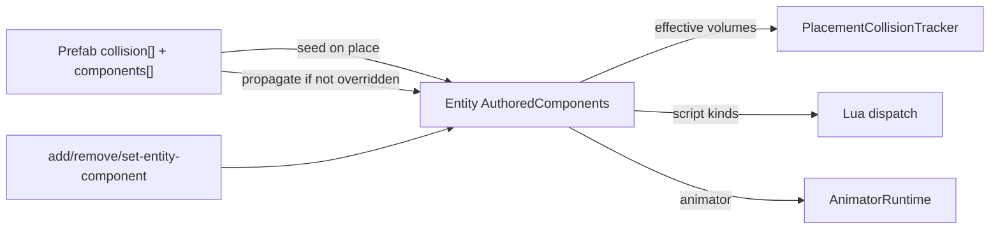

# Entity Components Reference

Status: active (TICKET-0148). Catalog of every entity component the engine uses today — core ECS plus authored Add Component types — and how they are authored, serialized, inherited, applied, and consumed.

Decisions: [DEC-0016](../decisions/index.md#dec-0016-entity-attached-components-and-dual-mcp-apply-paths), [DEC-0017](../decisions/index.md#dec-0017-prefab-and-scene-component-authoring-with-unity-like-inheritance), [DEC-0022](../decisions/index.md#dec-0022-c-animator-backend-with-lua-drive-api) (animator as authored component).

Headers: [`include/engine/world/components.h`](../../include/engine/world/components.h), [`include/engine/world/authored_components.h`](../../include/engine/world/authored_components.h).

## Mental model

| Layer | What it is | Owned by |
| --- | --- | --- |
| **Core ECS** | Always-on identity / transform / hierarchy / placement | Scene registry; mutated only through commands |
| **Authored components** | Optional collider / scriptBinding / animator entries on prefabs and entities | Prefab JSON seed + entity `components[]` with inherit/override |

Scene entities own runtime authored entries after placement (DEC-0016). Prefab edits propagate into non-overridden instance entries (DEC-0017). The GUI and MCP must not poke registry fields directly — use `CommandHistory` / documented MCP actions (DEC-0003).

---

## Core ECS components

From `components.h`. These are not Add Component menu items; they are the entity spine.

| Component | Purpose | Who writes | Persistence |
| --- | --- | --- | --- |
| **Id** (`IdComponent`) | Stable `EntityId` (UUID) | Created with the entity; never reassigned by editor tools | Scene/world entity id |
| **Name** (`NameComponent`) | Display / hierarchy label | Rename commands / Inspector / MCP rename | Entity `name` in scene JSON |
| **Transform** (`TransformComponent`) | Local position, quaternion rotation, scale | Move/gizmo / `move-world-object` / MCP place-move | Entity transform in scene JSON |
| **Hierarchy** (`HierarchyComponent`) | Optional parent `EntityId` | Hierarchy commands (limited; remove-with-children rejected until implemented) | Parent link when present |
| **WorldPlacement** (`WorldPlacementComponent`) | Prefab path, derived cell, optional character spawn + settings | Place / move (cell from position) / Inspector character fields | `placement` object — see [`world-placement.md`](../formats/world-placement.md) |

Notes:

- Cell ownership is derived from world position (128 m partition). Authored cell values that disagree with position fail validation.
- `characterAsset` / `characterSettings` mark player spawns; see world-placement contract. Not an authored Add Component type.
- Transient runtime handles (physics body ids, animator instances) are **not** core ECS components and are not serialized on the entity.

---

## Authored components

Enum `AuthoredComponentType`: `Collider`, `ScriptBinding`, `Animator`, `Rigidbody`. Stored on the entity as `AuthoredComponentsComponent` (`entries[]` + `generation`).

JSON type strings: `"collider"`, `"scriptBinding"`, `"animator"`, `"rigidbody"`.

**Rigidbody ([DEC-0038](../decisions/index.md#dec-0038-authored-rigidbody--dynamic-bodies-for-player-and-entities), TICKET-0196/0197/0198):** universal Add Component for player and any physics prefab. Fields: `motionType` (`dynamic` \| `kinematic`), `mass`, `linearDamping`, `angularDamping`, `useGravity`, `freezeRotation`. Runtime: `PlacementCollisionTracker` spawns one Dynamic-layer motion body from the first solid Collider + Rigidbody; sensors stay separate. Play/test drives the sample player via `RigidbodyLocomotion` on that body (CharacterVirtual remains fallback / `--debug-world`).

### Shared entry fields (scene / entity JSON)

| Field | Meaning |
| --- | --- |
| `id` | Stable entry id (e.g. `collision-0`, `script-0`). Links prefab seed ↔ instance for inherit/override |
| `type` | `collider` \| `scriptBinding` \| `animator` |
| `source` | `"prefab"` when `from_prefab` (seeded/linked); `"instance"` when added only on the entity |
| `overridden` | `true` after an instance edit; blocks prefab propagation for that id |
| `data` | Type-specific payload |

Prefab assets use `collision[]` for colliders (legacy-compatible) and optional top-level `components[]` for scriptBinding / animator (collider entries under `components` merge into `collision[]` on load). See [`prefab-assets.md`](../formats/prefab-assets.md).

### Collider

| Topic | Detail |
| --- | --- |
| Purpose | Physics / trigger / interaction / combat volumes relative to the placement |
| Prefab seed | Prefab `collision[]` (and merged `components` colliders) |
| Entity data | Same shape fields as prefab volumes: `shape` (`box` \| `sphere` \| `capsule`), `layer`, `trigger`, optional `interaction` / `combatHit` / `combatHurt`, local `transform`, `halfExtent` / `radius` / `halfHeight` |
| Effective volumes | `effective_collision_volumes(entity, prefab)`: if the entity has authored entries, use each entry’s local data when overridden/instance-owned, else linked prefab volume by `id`; if the entity has **no** authored components, fall back to prefab `collision[]` |
| Runtime | `spawn_prefab_collision` / `PlacementCollisionTracker`; debug green wireframes in Scene viewport for selected authored colliders |

Full field list: [`prefab-assets.md`](../formats/prefab-assets.md) (collision section). Feature pointers: [`collision-debug.md`](../features/collision-debug.md), [`interaction-volumes.md`](../features/interaction-volumes.md), [`combat-volumes.md`](../features/combat-volumes.md).

### ScriptBinding

| Topic | Detail |
| --- | --- |
| Purpose | Bind an entity/prefab to a Lua handler via `assets/scripts/bindings.script.json` |
| `data.kind` | `interaction` \| `combatHit` \| `combatHurt` \| `handler` |
| `data.bindingId` | Binding id in the scripts catalog |
| Prefab seed | Prefab `components[]` entry `type: "scriptBinding"` |
| Runtime | Dispatch on overlap / explicit call paths; host API in [`lua-scripting.md`](../features/lua-scripting.md). MCP `engine_lua_call` can invoke without physical overlap |

Do not duplicate the full Lua sandbox or binding schema here — link out.

### Animator

| Topic | Detail |
| --- | --- |
| Purpose | Attach a C++ animator controller to an entity/prefab ([DEC-0022](../decisions/index.md#dec-0022-c-animator-backend-with-lua-drive-api)) |
| `data.controller` | Project-relative `*.animator.json` |
| `data.defaultState` | Optional override of layer default; editor uses a state dropdown |
| Prefab seed | Prefab `components[]` entry `type: "animator"` |
| Runtime | `AnimatorRuntime`; Lua drive `engine.animator_*`; timeline events → `on_animation_event` |

Format: [`animator-controller-assets.md`](../formats/animator-controller-assets.md). Feature: [`animator.md`](../features/animator.md).

> Ticket 0148’s original acceptance named collider + scriptBinding as the first authored slice. **Animator is shipped** under the same inherit/override model; catalog it here. Do not invent further kinds in this doc.

### Inherit / override rules (DEC-0017)

1. **Place** → seed entity entries from prefab (`source: "prefab"`, `overridden: false`).
2. **Instance edit** (Inspector / MCP set) → marks that entry `overridden: true` (and may set `source: "instance"` for purely local adds).
3. **Prefab save / prefab component apply** → `propagate_prefab_components_into_entries` updates non-overridden prefab-sourced entries; removes prefab-sourced non-overridden entries deleted from the prefab; leaves overridden entries alone.
4. **Legacy worlds** without `components[]` still spawn physics from prefab `collision[]`. Editor seeds missing authored components on load/select for Inspector/overlays; save persists the array.

---

## Authoring surface matrix

| Surface | What you can do | Path |
| --- | --- | --- |
| **Scene Inspector** | Add Collider / Script Binding / Animator; expand to edit props; Open Script; remove | GUI → `CommandHistory` (`add-entity-component` / `set-entity-component` / `remove-entity-component`) |
| **Prefab Editor** | Same component add/edit/remove on the prefab asset; Save Prefab propagates | Asset Browser **Edit** → prefab JSON write + instance propagate |
| **CLI / commands** | `add-entity-component`, `remove-entity-component`, `set-entity-component` (+ place/move/remove) | Automation / editor session |
| **MCP scene** | `engine_scene_apply` actions `add_component` / `remove_component` / `set_component` (also batch) | Same commands as Inspector |
| **MCP entity** | `engine_entity_component_apply` | Dedicated dual path (DEC-0016) |
| **MCP prefab** | `engine_prefab_apply` / `engine_prefab_component_apply` | Prefab JSON + propagate |
| **MCP plan** | `engine_scene_plan` | Classifies scene vs prefab vs Lua vs C++ |

Details: [`mcp-live-editor.md`](../features/mcp-live-editor.md), [`editor-mvp.md`](../features/editor-mvp.md), [`content-vs-engine-workflows.md`](content-vs-engine-workflows.md).

Lookup fields (binding ids, controller paths, animator states) use dropdowns / catalogs where the editor already supports them — see workspace rule on lookup fields.

---

## Runtime consumption (pointers only)

| Consumer | Reads | Spec |
| --- | --- | --- |
| Placement / collision spawn | Effective collider volumes | [`prefab-assets.md`](../formats/prefab-assets.md), [`collision-debug.md`](../features/collision-debug.md) |
| Interaction / combat sensors | Collider `interaction` / `combatHit` / `combatHurt` + scriptBinding kinds | [`interaction-volumes.md`](../features/interaction-volumes.md), [`combat-volumes.md`](../features/combat-volumes.md) |
| Lua handlers | scriptBinding → bindings catalog → `.lua` | [`lua-scripting.md`](../features/lua-scripting.md) |
| Animator backend | animator component → controller asset | [`animator.md`](../features/animator.md) |
| Rigidbody (authored) | rigidbody + first solid collider → Jolt dynamic/kinematic; transform write-back in play/test | [DEC-0038](../decisions/index.md#dec-0038-authored-rigidbody--dynamic-bodies-for-player-and-entities) |
| Character / root motion | Animator + character controller (transitional; migrate to Rigidbody in EPIC-0015) | [`character-controller.md`](../features/character-controller.md) |

---

## Extension checklist (new authored type)

When adding a future `AuthoredComponentType` (do not invent product scope here — this is the touch list):

1. **Enum + data struct** in `authored_components.h` / `.cpp` (parse/name, validate entry, JSON round-trip).
2. **Prefab format** — document in `prefab-assets.md`; load/merge rules; seed from prefab.
3. **Scene format** — `source` / `overridden` in `world-placement.md`; serialize in scene load/save.
4. **Propagation** — teach `propagate_prefab_components_into_entries` / effective helpers if needed.
5. **Commands** — add/remove/set entity (and prefab write path) through `CommandHistory`.
6. **MCP** — `engine_scene_apply` / `engine_entity_component_apply` / prefab apply actions + `engine_scene_plan` classification.
7. **Editor** — Prefab Editor + Scene Inspector Add Component menus, property UI, orphan-safe dropdowns for lookups.
8. **Runtime consumer** — wire the system that reads the component; link feature/format docs.
9. **Tests** — inherit vs override, validate, MCP/command round-trip.
10. **This doc** — add a catalog row; update features index if status changes.

---

## Gaps and non-goals

| Item | Status |
| --- | --- |
| New authored kinds beyond collider / scriptBinding / animator / rigidbody | Out of scope — do not invent here |
| Inspector property edit + Open Script | Landed under TICKET-0149 track; see [`editor-mvp.md`](../features/editor-mvp.md) |
| Arbitrary user C++ component plugins / marketplace | Out of scope |
| Changing inherit/override or MCP contracts | File a bug / follow-on if docs uncover defects |
| Full Lua API expansion | TICKET-0116 |
| Specialized M10 tools | TICKET-0131–0138 |

---

## Related docs

- Architecture: [overview.md](overview.md), [content-vs-engine-workflows.md](content-vs-engine-workflows.md)
- Formats: [prefab-assets.md](../formats/prefab-assets.md), [world-placement.md](../formats/world-placement.md), [animator-controller-assets.md](../formats/animator-controller-assets.md)
- Features: [editor-mvp.md](../features/editor-mvp.md), [mcp-live-editor.md](../features/mcp-live-editor.md), [lua-scripting.md](../features/lua-scripting.md), [animator.md](../features/animator.md)
