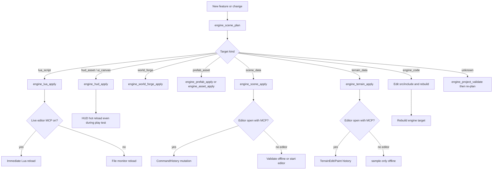

# Content vs Engine Workflows

Status: active

This document routes feature work between C++ engine changes and MCP-driven project content edits. It implements [DEC-0011](../decisions/index.md) and complements [DEC-0002](../decisions/index.md) and [DEC-0010](../decisions/index.md).

## Decision tree

## Use C++ engine code when

- Adding or changing runtime capability: movement, physics, rendering, input, audio, animation (including the animator controller/backend), collision, streaming, save/load.
- Extending asset schemas, loaders, validators, or editor panels for new fields.
- Exposing new Lua bindings or handler payload types.
- Fixing bugs in engine systems or automation command paths.
- Performance, determinism, or platform integration work.

Movement and character control (including jump) are engine-owned today. Lua does not expose movement APIs in v1.

Animation follows the same pattern once TICKET-0103 lands ([DEC-0022](../decisions/index.md#dec-0022-c-animator-backend-with-lua-drive-api)): C++ owns the animator controller/backend; Lua only drives parameters / state requests and reacts to events from combat/movement/interaction scripts ([animator.md](../features/animator.md)).

## Use MCP content tools when

- Editing scene placement, transforms, entity metadata, or entity components: `engine_scene_apply` / `engine_entity_component_apply`. Component catalog and inherit/override: [`components.md`](components.md).
- Sculpting or painting terrain height/materials/foliage: `engine_terrain_apply` (raise/lower/flatten/paint/paint_foliage; requires live editor MCP except `sample`).
- Creating or updating prefabs (including collision/components) and materials: `engine_prefab_apply`, `engine_prefab_component_apply`, `engine_asset_apply`.
- Writing Lua handler bodies for existing interaction or combat IDs (using host API v1: `engine.log` / `json_decode` / blackboard / `hud_*` / `set_health`): `engine_lua_apply`.
- Editing UI canvases (`*.uicanvas.json`) or legacy HUD (`*.hud.json`): `engine_hud_apply`.
- Editing World Forge narrative assets (`*.worldforge.json`): `engine_world_forge_apply` (including `action=import_twee` for dialogues).
- Classifying ambiguous work before editing: `engine_scene_plan`.
- Validating project data after batches: `engine_project_validate`.

## Sharing work across machines (authoring sync)

World Forge and other project assets are **git-tracked text**. Multi-author sharing uses git push/pull — not a custom cloud-save service ([DEC-0037](../decisions/index.md#dec-0037-git-backed-authoring-sync-in-editor)). Workflow and planned in-editor **Project Sync**: [`../features/authoring-git-sync.md`](../features/authoring-git-sync.md) (EPIC-0014). After pull, reload World Forge (and respect live Scene/Sculpt ownership below).

## World Forge

World Forge is the **narrative tooling umbrella** inside the editor ([world-forge-scope.md](../features/world-forge-scope.md); [DEC-0019](../decisions/index.md#dec-0019-world-forge-editor-home-and-story-canon-split), [DEC-0020](../decisions/index.md#dec-0020-world-forge-narrative-tooling-umbrella)). It is **not** a parallel scene/terrain edit path.

- Edit structured World Forge assets with `engine_world_forge_apply` (`action=get|validate|apply|import_twee`, `kind=factions|relationships|map|quests|dialogues`).
- Formats: [`world-forge-factions.md`](../formats/world-forge-factions.md), [`world-forge-relationships.md`](../formats/world-forge-relationships.md), [`world-forge-map.md`](../formats/world-forge-map.md).
- Story canon stays in `context/story/`; World Forge JSON is the engine/integration layer.
- Do not place/move meshes through World Forge — use Scene/MCP for that.

Classifier: `engine_scene_plan` returns `targetKind=world_forge` for `*.worldforge.json` / `world-forge` paths.

## Live editor rules

- Enable **MCP connection** in Diagnostics before live scene, prefab, terrain, or Lua apply while the editor is running.
- Do not write open `.world.json` files directly while the editor session owns the scene.
- Play-test sessions block scene mutation until ended.
- `bindings.script.json` changes require editor restart; handler `.lua` files hot reload through the bridge or file monitor.

## Classifier limitations

`engine_scene_plan` uses path and description heuristics (`classify_scene_plan` in `src/automation/editor_session.cpp`). It is not semantic. Prefer explicit `targetPath` extensions (`.lua`, `.prefab.json`, `.world.json`) and clear descriptions. When classification is `unknown`, run `engine_project_validate` before applying changes.

## Verification

| Change type | Minimum verification |
| --- | --- |
| C++ engine | Rebuild `engine`; run affected CTest suites |
| Lua handler | `scripting` suite; live reload or file monitor |
| Scene/prefab/asset | `engine_project_validate`; automation suite when bridge logic changes |
| Movement/physics | `character` suite and manual play-test |

See [mcp-live-editor.md](../features/mcp-live-editor.md) for tool schemas and [lua-scripting.md](../features/lua-scripting.md) for handler scope.
