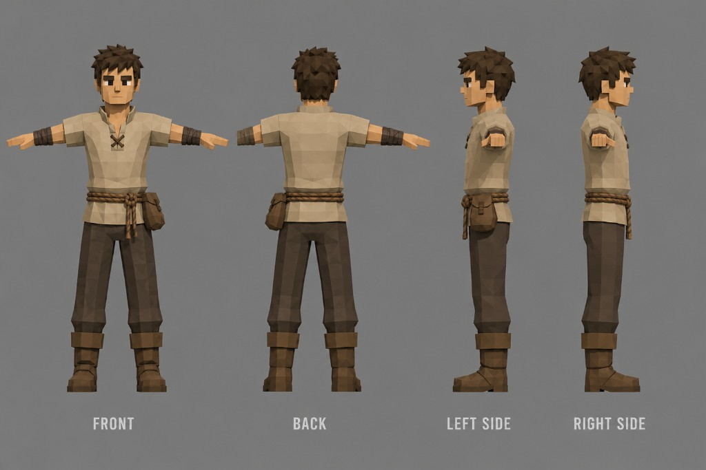

# Character Art Direction

- Status: developing art context
- Related decisions: [DEC-0006](../decisions/index.md#dec-0006-smooth-low-poly-art-direction), [DEC-0009](../decisions/index.md#dec-0009-starting-archetype-character-creation)

## Reference baseline

The starting-player concept establishes the humanoid character look for v1. It should read as humble, drafted, and functional—not heroic plate armor.

| Reference | Archetype | File |
| --- | --- | --- |
| Starting player turnaround (Squire) | Squire starting kit | `reference/starting-player-squire-turnaround.png` |

## Style

- **Geometry:** Low-poly faceted meshes with visible planar surfaces; blocky but readable silhouettes.
- **Detail level:** Simple facial planes, stylized spiky hair, minimal surface ornament.
- **Palette:** Muted earth tones—tan/beige cloth, chocolate-brown trousers and wraps, worn leather-brown belt and pouch. Aligns with the broader palette in [Visual Direction](visual-direction.md).
- **Presentation:** Standard T-pose turnaround sheets (front, back, left, right) for modeling, rigging, and review.

## Starting Squire kit (reference)

Directional breakdown from the concept; exact mesh names and material slots remain to be defined in asset formats.

| Piece | Direction |
| --- | --- |
| Hair | Stylized spiky dark brown; separate mesh or hair cap acceptable at this detail level |
| Torso | Short-sleeve beige/tan tunic, simple V-neck with dark cord tie |
| Arms | Dark brown forearm wraps |
| Waist | Thick braided rope belt; small leather pouch on left hip |
| Legs | Straight dark brown trousers |
| Feet | Mid-calf brown boots with slightly darker cuff trim |

No heavy armor, capes, or faction insignia at start. Progression armor should layer over or replace these base pieces.

## Customization direction

The simple tunic/trouser/boot base supports:

- **Palette swaps** on cloth and leather regions without remeshing.
- **Layered equipment** (pauldrons, chest pieces, cloaks) over the base body.
- **Shared body proportions** across starting archetypes, with archetype-specific starter kits (Archer and Acolyte references still needed).

Appearance customization fields at character creation remain undefined in [Character Creation](../story/character-creation.md).

## Production notes

- Rig from T-pose; keep limbs aligned for retargeting across archetypes.
- Favor modular skinned meshes or material regions over texture-heavy detail.
- Maintain strong value separation from terrain and enemies during combat readability tests.
- Archer and Acolyte starting kits should receive matching turnaround references before finalizing the player creation flow.

## Open questions

- Flat shading versus softened normals on characters (inherits open terrain/prop question in visual direction).
- Whether hair is mesh-only or also supports a small set of preset styles at creation.
- Final body proportion targets for female and other body presets.
- Whether starting kits share one base body mesh with kit swaps or use per-archetype bodies.
