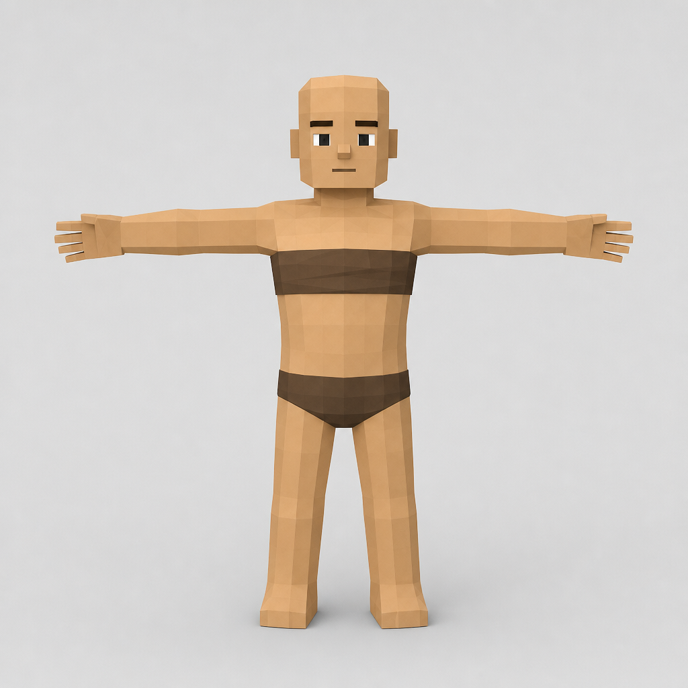
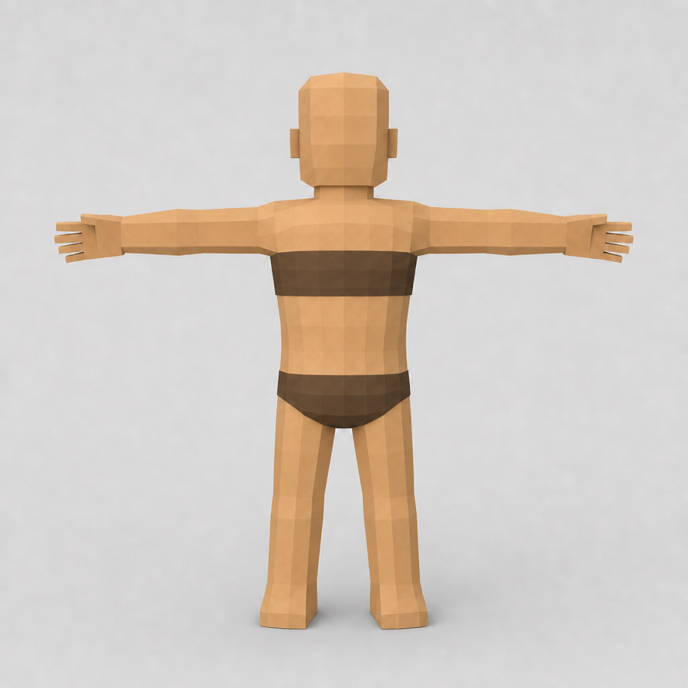
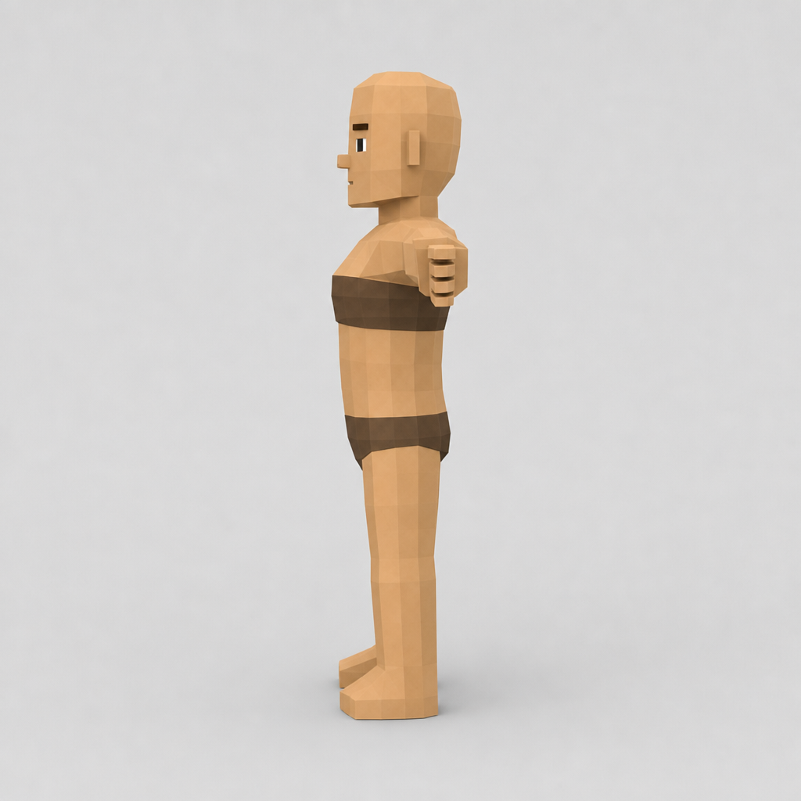
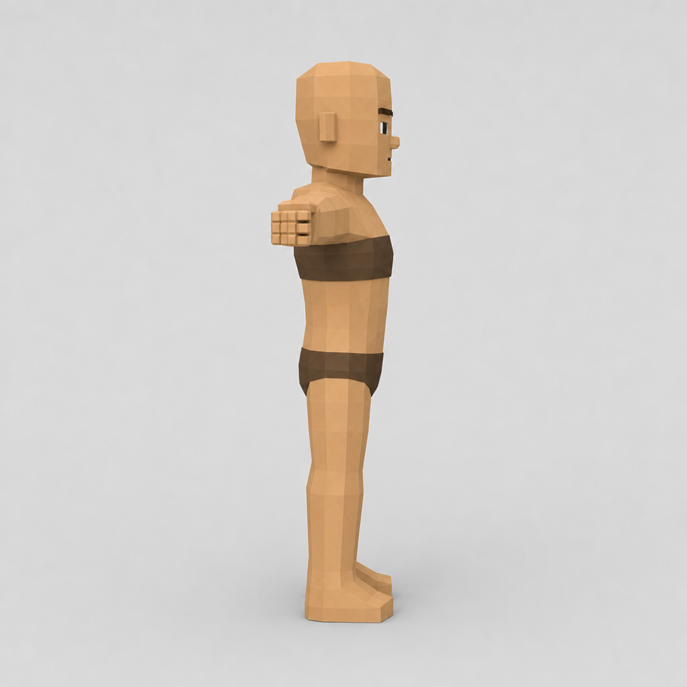

# Character Art Direction

- Status: developing art context
- Related decisions: [DEC-0006](../decisions/index.md#dec-0006-smooth-low-poly-art-direction), [DEC-0009](../decisions/index.md#dec-0009-starting-archetype-character-creation)

## Reference baseline

The starting-player concept establishes the humanoid character look for v1. It should read as humble, drafted, and functional—not heroic plate armor.

| Reference | Role | File |
| --- | --- | --- |
| Player base body front (canonical) | Shared male body foundation — **approved standard** | `reference/player-base-body-front.png` |
| Player base body back | Orthographic derived from front | `reference/player-base-body-back.png` |
| Player base body left | Orthographic derived from front | `reference/player-base-body-left.png` |
| Player base body right | Orthographic derived from front | `reference/player-base-body-right.png` |
| Starting player turnaround (Squire) | Squire starting kit over base body | `reference/starting-player-squire-turnaround.png` |

## Style

- **Geometry:** Low-poly faceted meshes with visible planar surfaces; blocky but readable silhouettes.
- **Detail level:** Simple facial planes, minimal surface ornament, planar limbs with minimal anatomy.
- **Palette:** Muted earth tones—tan/beige skin and cloth, chocolate-brown undergarments / trousers / wraps, worn leather-brown belt and pouch. Aligns with the broader palette in [Visual Direction](visual-direction.md).
- **Presentation:** Front T-pose is the locked look reference. Back / left / right sheets are derived from that front; mesh work must match the front first.

## Locked base body (v1)

Shared male foundation under all starting archetype kits. Target height ≈ 1.8 m; feet at y=0; T-pose. **Canonical look:** `reference/player-base-body-front.png` (approved).

| Piece | Direction |
| --- | --- |
| Head | Bald / hair-cap scalp; hair is a separate modular mesh (not baked into body) |
| Face | White square sclera + small black square pupils; thick dark brows; small block nose; flat mouth line |
| Torso / limbs | Lean blocky proportions from the approved front; no heroic musculature |
| Chest | Thin dark-brown wrap / bandeau strip (functional coverage, not armor) |
| Lower | Simple dark-brown briefs |
| Hands | Blocky digits with visible fingers (refine length in mesh if concept reads stubby) |
| Anatomy | Minimal — planar limbs |

Female and other body presets remain deferred. Starting kits share this one base body with kit swaps.

## Starting Squire kit (reference)

Directional breakdown from the concept; exact mesh names and material slots remain to be defined in asset formats. Layers over the locked base body.

| Piece | Direction |
| --- | --- |
| Hair | Stylized spiky dark brown; separate mesh attached to hair-cap |
| Torso | Short-sleeve beige/tan tunic, simple V-neck with dark cord tie |
| Arms | Dark brown forearm wraps |
| Waist | Thick braided rope belt; small leather pouch on left hip |
| Legs | Straight dark brown trousers |
| Feet | Mid-calf brown boots with slightly darker cuff trim |

No heavy armor, capes, or faction insignia at start. Progression armor should layer over or replace these base pieces.

## Customization direction

The simple tunic/trouser/boot base supports:

- **Palette swaps** on cloth and leather regions without remeshing.
- **Layered equipment** (pauldrons, chest pieces, cloaks) over the base body.
- **Shared body proportions** across starting archetypes, with archetype-specific starter kits (Archer and Acolyte references still needed).
- **Hair presets** as separate meshes on the shared hair-cap (style set still TBD).

Appearance customization fields at character creation remain undefined in [Character Creation](../story/character-creation.md).

## Production notes

- Rig from T-pose; keep limbs aligned for retargeting across archetypes.
- Favor modular skinned meshes or material regions over texture-heavy detail.
- Maintain strong value separation from terrain and enemies during combat readability tests.
- Archer and Acolyte starting kits should receive matching turnaround references before finalizing the player creation flow.
- Author Blockbench body from `reference/player-base-body-front.png` (primary) with back/left/right as orthographic support into `tools/art/player/` before kit meshes.

## Open questions

- Flat shading versus softened normals on characters (inherits open terrain/prop question in visual direction).
- Which hair preset set ships at character creation (spikes as default Squire look is expected).
- Final body proportion targets for female and other body presets (deferred after male v1).
- Finger length / hand articulation polish when baking the mesh from the front standard.
