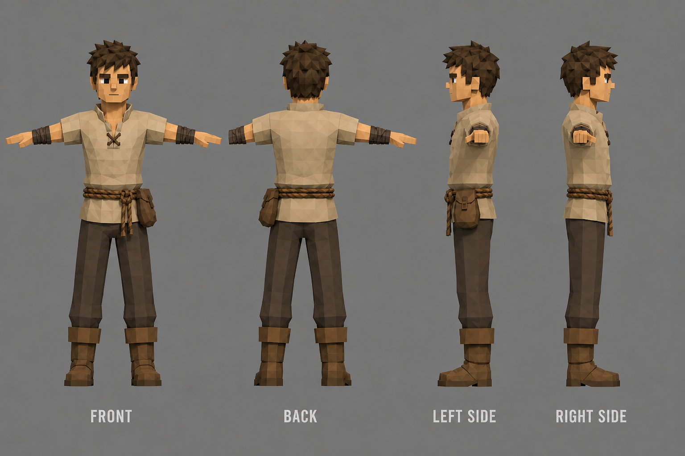
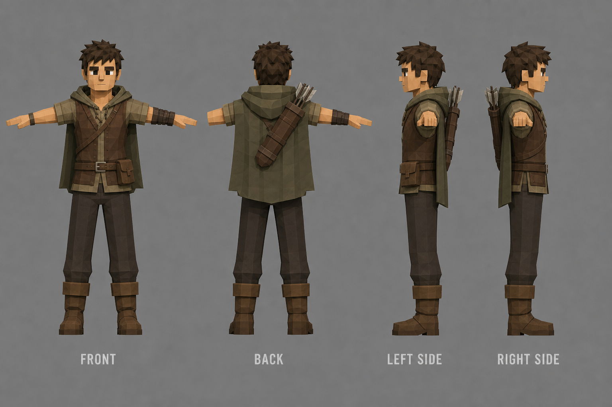
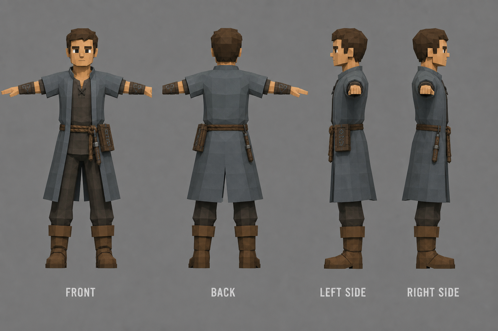

# Character Art Direction

- Status: developing art context
- Related decisions: [DEC-0006](../decisions/index.md#dec-0006-smooth-low-poly-art-direction), [DEC-0009](../decisions/index.md#dec-0009-starting-archetype-character-creation)

## Reference baseline

The starting-player concept establishes the humanoid character look for v1. It should read as humble, drafted, and functional—not heroic plate armor.

| Reference | Role | File |
| --- | --- | --- |
| Player base body front (canonical) | Shared male body foundation — **approved standard** | `reference/player-base-body-front.png` |
| Player base body back | Orthographic derived from front | `reference/player-base-body-back.png` |
| Player base body left | Orthographic derived from front | `reference/player-base-body-left.png` |
| Player base body right | Orthographic derived from front | `reference/player-base-body-right.png` |
| Starting player turnaround (Ashfell Blade) | Ashfell Blade starting kit over base body | `reference/starting-player-ashfell-blade-turnaround.png` |
| Starting player turnaround (Outrider) | Outrider Lodge scout kit over base body | `reference/starting-player-outrider-turnaround.png` |
| Starting player turnaround (Runecaster) | Runecaster Guild inscribed kit over base body | `reference/starting-player-runecaster-turnaround.png` |
| Starting player turnaround (Ashfell Blade, legacy) | Earlier Squire-era sheet; keep for provenance | `reference/starting-player-squire-turnaround.png` |

## Style

- **Geometry:** Low-poly faceted meshes with visible planar surfaces; blocky but readable silhouettes.
- **Detail level:** Simple facial planes, minimal surface ornament, planar limbs with minimal anatomy.
- **Palette:** Muted earth tones—tan/beige skin and cloth, chocolate-brown undergarments / trousers / wraps, worn leather-brown belt and pouch. Aligns with the broader palette in [Visual Direction](visual-direction.md).
- **Presentation:** Front T-pose is the locked look reference. Back / left / right sheets are derived from that front; mesh work must match the front first.

## Locked base body (v1)

Shared male foundation under all starting archetype kits. Target height ≈ 1.8 m; feet at y=0; T-pose. **Canonical look:** `reference/player-base-body-front.png` (approved).

| Piece | Direction |
| --- | --- |
| Head | Bald / hair-cap scalp; hair is a separate modular mesh (not baked into body) |
| Face | Eyes + mouth painted on the atlas (not separate eye meshes); thick dark brows + small block nose modeled; flat painted mouth line |
| Torso / limbs | Lean blocky proportions from the approved front; no heroic musculature |
| Chest | Thin dark-brown wrap / bandeau strip (functional coverage, not armor) |
| Lower | Simple dark-brown briefs |
| Hands | Blocky digits with visible fingers (refine length in mesh if concept reads stubby) |
| Anatomy | Minimal — planar limbs |

Female and other body presets remain deferred. Starting kits share this one base body with kit swaps.

## Starting Ashfell Blade kit (reference)

Directional breakdown from `reference/starting-player-ashfell-blade-turnaround.png`; exact mesh names and material slots remain to be defined in asset formats. Layers over the locked base body.

| Piece | Direction |
| --- | --- |
| Hair | Stylized spiky dark brown; separate mesh attached to hair-cap |
| Torso | Short-sleeve beige/tan tunic, simple V-neck with dark cord tie |
| Arms | Dark brown forearm wraps |
| Waist | Thick braided rope belt; small leather pouch on left hip |
| Legs | Straight dark brown trousers |
| Feet | Mid-calf brown boots with slightly darker cuff trim |

No heavy armor, capes, or faction insignia at start. Progression armor should layer over or replace these base pieces. Starter weapon concept: [starter-ashfell-arming-sword.png](concepts/starter-ashfell-arming-sword.png).

## Starting Outrider kit (reference)

Directional breakdown from `reference/starting-player-outrider-turnaround.png`. Same base body; Lodge scout / skirmisher read.

| Piece | Direction |
| --- | --- |
| Hair | Short messy dark brown spikes (under hood when worn) |
| Torso | Olive-tan undershirt + darker leather vest / jerkin |
| Cloak | Short olive-grey hooded cloak; hood down on shoulders for face read |
| Arms | Leather archery bracer (stronger on draw arm); simpler wrap opposite |
| Waist | Thin utility belt; small pouch |
| Back | Compact quiver + a few arrows; chest strap visible on front |
| Legs / feet | Dark trousers; mid-calf worn brown boots |

No heavy armor. Starter weapon concept: [starter-outrider-shortbow.png](concepts/starter-outrider-shortbow.png).

## Starting Runecaster kit (reference)

Directional breakdown from `reference/starting-player-runecaster-turnaround.png`. Same base body; Guild inscribed-caster read — **not** Cristallo crystal-warden robes.

| Piece | Direction |
| --- | --- |
| Hair | Shorter, flatter dark brown tufts |
| Torso | Dark charcoal tunic under open slate / dusty blue-grey wrap-coat (knee length, back split) |
| Arms | Dark wraps with faint angular etched rune marks (cool inlay, not neon glow) |
| Waist | Rope / leather sash; inscribed pouch + small cylindrical focus / scroll case |
| Legs / feet | Dark trousers; mid-calf brown boots matching shared kit language |

No wizard hat, towering staff, or crystal-guardian silhouette. Starter focus concept: [starter-runecaster-rune-focus.png](concepts/starter-runecaster-rune-focus.png).

## Customization direction

The simple tunic/trouser/boot base supports:

- **Palette swaps** on cloth and leather regions without remeshing.
- **Layered equipment** (pauldrons, chest pieces, cloaks) over the base body.
- **Shared body proportions** across starting archetypes, with archetype-specific starter kits (turnarounds locked for v1 first pass).
- **Hair presets** as separate meshes on the shared hair-cap (spikes default Ashfell Blade; shorter sets for Outrider / Runecaster).

Appearance customization fields at character creation remain undefined in [Character Creation](../story/character-creation.md).

## Production notes

- Rig from T-pose; keep limbs aligned for retargeting across archetypes.
- Favor modular skinned meshes or material regions over texture-heavy detail.
- Maintain strong value separation from terrain and enemies during combat readability tests.
- Author Blockbench kit meshes from the three starting turnarounds + `reference/player-base-body-front.png` into `tools/art/player/` (or kit subfolders) before bake.
- **Player_V3 WIP:** bald Ashfell Blade kit T-pose (palms down) in `tools/art/player/Player_V3.bbmodel`, built from `reference/starting-player-ashfell-blade-turnaround.png` without hair; regenerator `tools/art/player/build_player_v3_ashfell.py`. No textures/armature yet.
- **GoodPlayerModel (runtime):** `tools/art/player/GoodPlayerModel_rigged.bbmodel` / `Documents/Models/GoodPlayerModel.gltf` — continuous BodyMesh + separate hand digit meshes; **37-bone** `PlayerArmature` matching `player.rig.json`; clips `Idle`/`Run`/`Fall`. Baked to `assets/models/player.gltf` via `tools/bake_player_v2_gltf.py` (`GoodPlayerModel-2026-07-30b`).
- First-pass turnarounds are concept targets; revise if Blockbench proportions or GoodPlayerModel silhouette diverge.

## Open questions

- Flat shading versus softened normals on characters (inherits open terrain/prop question in visual direction).
- Which hair preset set ships at character creation (spikes default Ashfell Blade; Outrider messy short; Runecaster flatter tufts — confirm at creation UI).
- Final body proportion targets for female and other body presets (deferred after male v1).
- Finger length polish on mesh bake if digits still read stubby (bbmodel now has open/close finger + thumb bones under each hand).
