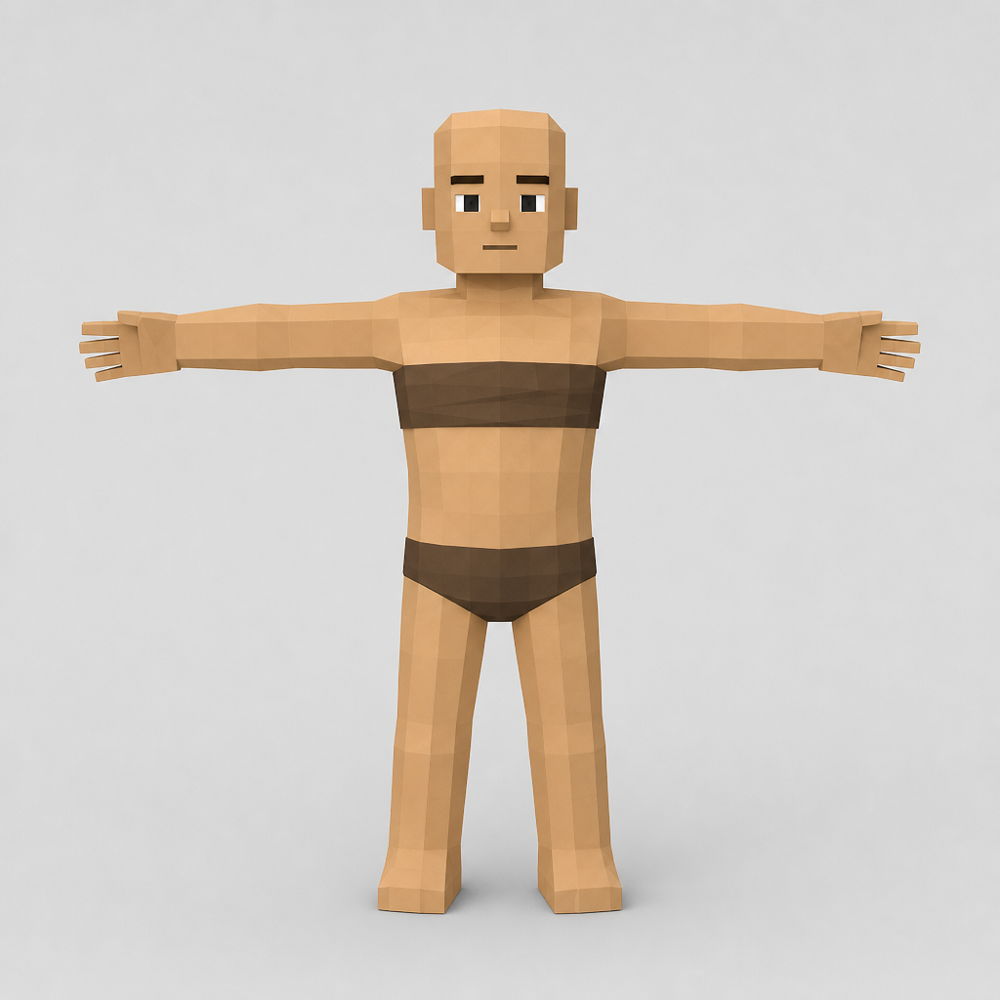
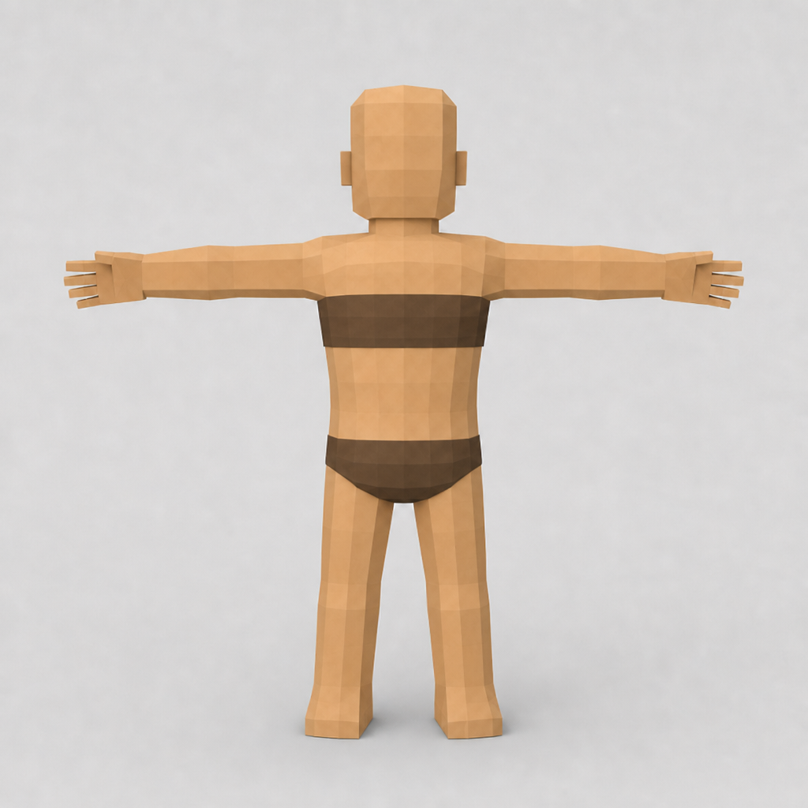
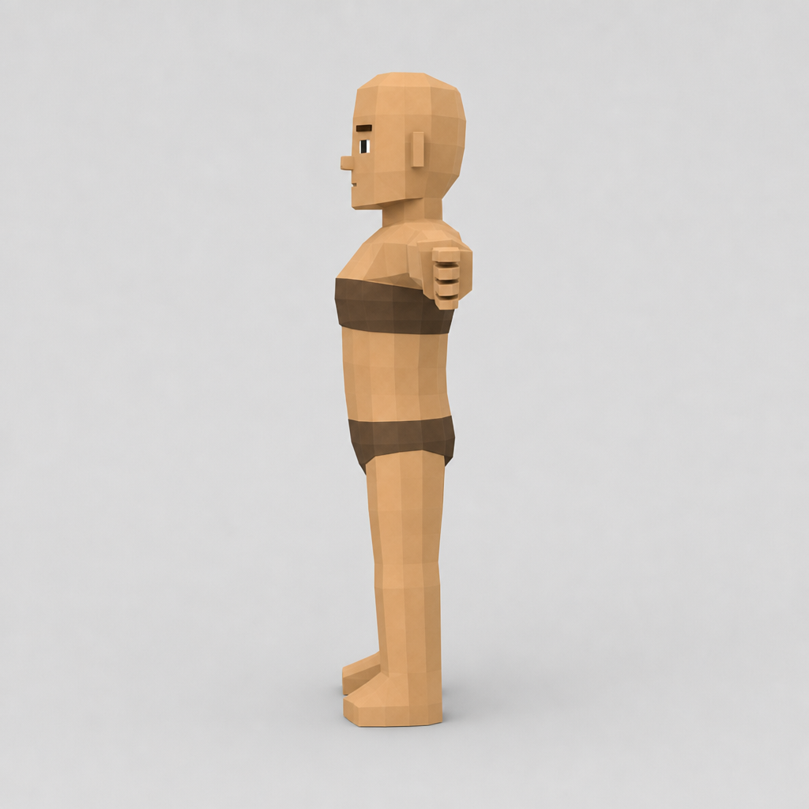
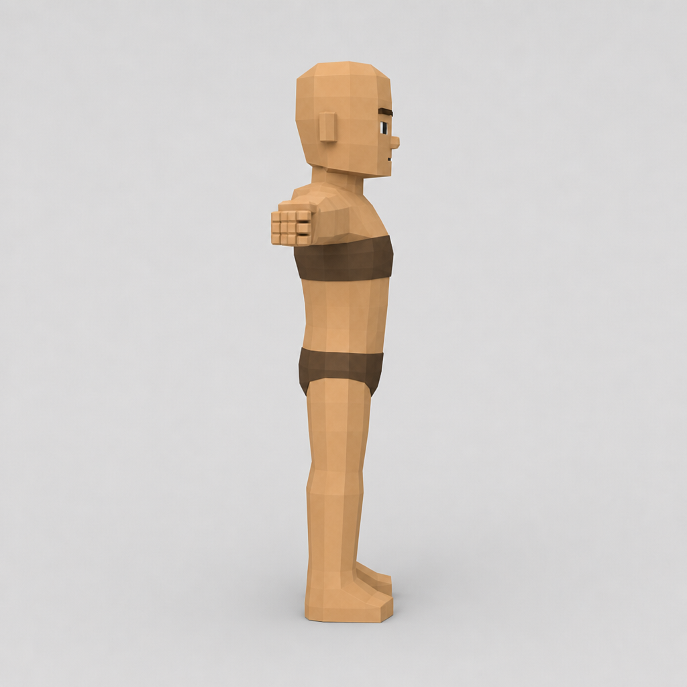
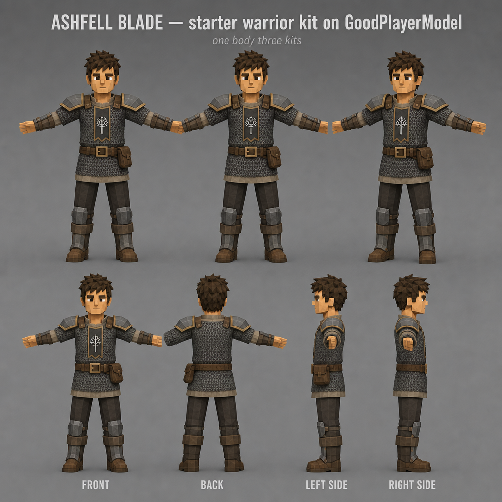
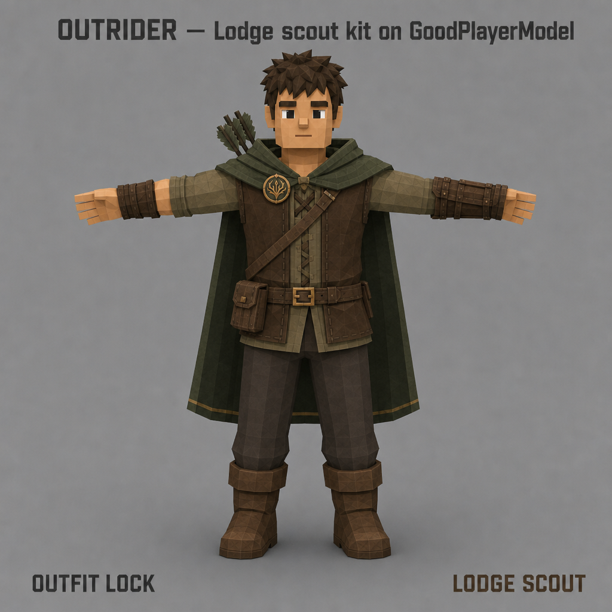
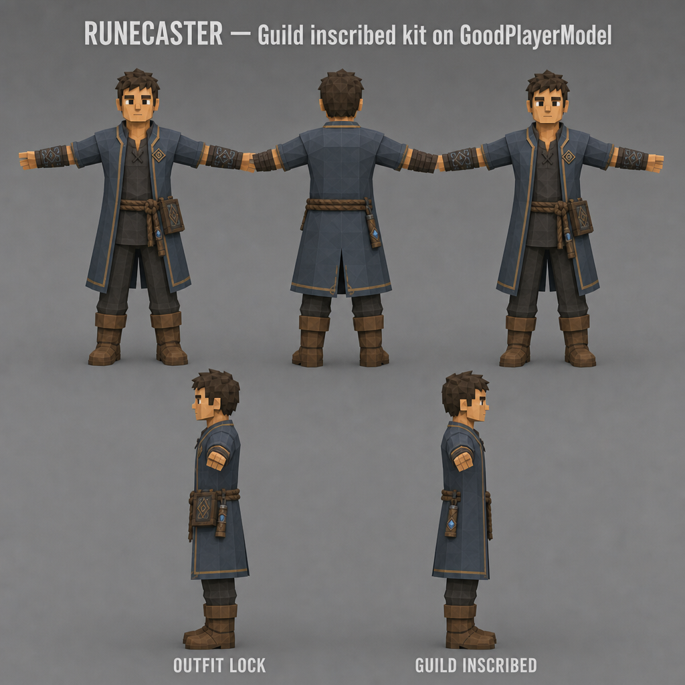
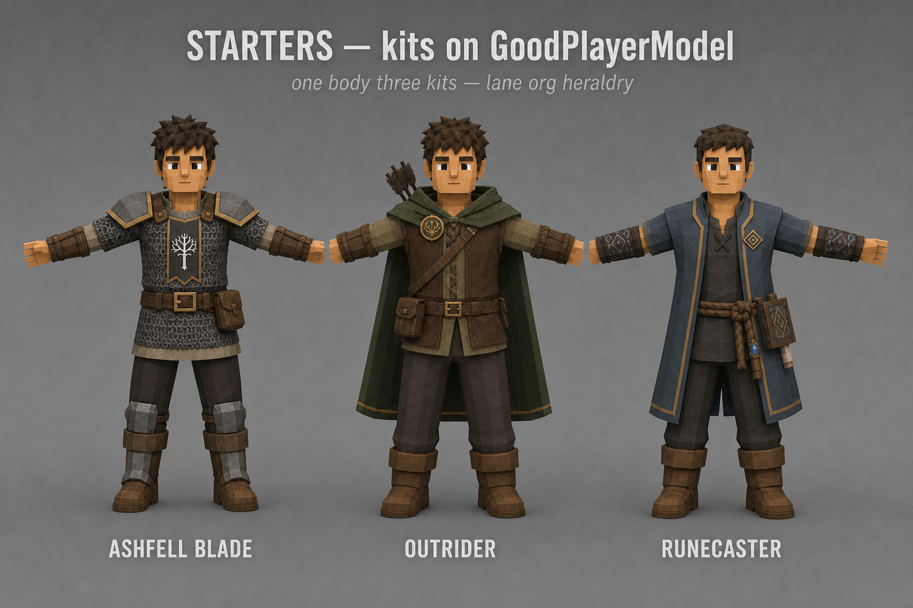

# Character Art Direction

- Status: developing art context
- Related decisions: [DEC-0006](../decisions/index.md#dec-0006-smooth-low-poly-art-direction), [DEC-0009](../decisions/index.md#dec-0009-starting-archetype-character-creation)

## Reference baseline

The starting-player concept establishes the humanoid character look for v1. It should read as humble, drafted, and functional—not heroic plate armor.

| Reference | Role | File |
| --- | --- | --- |
| Player base body front (canonical) | Shared male body foundation — **approved standard** | `reference/player-base-body-front.png` |
| Player base body back | Orthographic derived from front | `reference/player-base-body-back.png` |
| Player base body left | Orthographic derived from front | `reference/player-base-body-left.png` |
| Player base body right | Orthographic derived from front | `reference/player-base-body-right.png` |
| Ashfell Blade starter concept | Mail / house heraldry kit lock | `concepts/act0-char-ashfell-blade.png` |
| Outrider Lodge starter concept | Forest-green Lodge scout kit lock | `concepts/act0-char-outrider.png` |
| Runecaster Guild starter concept | Navy inscribed Guild kit lock | `concepts/act0-char-runecaster.png` |
| Starter trio lineup | Ashfell / Outrider / Runecaster side-by-side | `concepts/act0-char-player-archetypes.png` |
| Starting player turnaround (Ashfell Blade, legacy) | Pre-mail cloth turnaround; provenance only | `reference/starting-player-ashfell-blade-turnaround.png` |
| Starting player turnaround (Outrider, legacy) | Pre-Lodge-stamp turnaround; silhouette provenance | `reference/starting-player-outrider-turnaround.png` |
| Starting player turnaround (Runecaster, legacy) | Pre-Guild-stamp turnaround; silhouette provenance | `reference/starting-player-runecaster-turnaround.png` |
| Starting player turnaround (Ashfell Blade, older) | Earlier Squire-era sheet; keep for provenance | `reference/starting-player-squire-turnaround.png` |
| Act 0 cast concept board | Companions, command, enemies, Luceran, Creotar | `concepts/act0-char-*.png` (+ canvas Characters filter) |

## Style

- **Geometry:** Low-poly faceted meshes with visible planar surfaces; blocky but readable silhouettes.
- **Detail level:** Simple facial planes, minimal surface ornament, planar limbs with minimal anatomy.
- **Palette:** Muted earth tones—tan/beige skin and cloth, chocolate-brown undergarments / trousers / wraps, worn leather-brown belt and pouch. Aligns with the broader palette in [Visual Direction](visual-direction.md).
- **Presentation:** Front T-pose is the locked look reference. Back / left / right sheets are derived from that front; mesh work must match the front first.

## Locked base body (v1)

**Runtime body (production lock):** **GoodPlayerModel** — source `tools/art/player/GoodPlayerModel.gltf` / `GoodPlayerModel_rigged.bbmodel`, baked to `samples/open-world-rpg/assets/models/player.gltf` (37-bone `PlayerArmature`, `player.rig.json`).  
All **Act 0 humanoids** (player kits, Arkand, Grenge, Larrell, Damius, Tessera soldiers, Imperium footsoldiers, and other player-scale allies/enemies) are **the same body mesh + skeleton** with **kit swaps** (clothing, armor, hair, props). Do **not** author separate body proportions / retarget-incompatible rigs per character.

Concept orthos under `reference/player-base-body-*.png` remain the style/proportion read for kit art when they match GoodPlayerModel; if concept and mesh diverge, **GoodPlayerModel wins**.

Shared male foundation under all starting archetype kits. Target height ≈ 1.8 m; feet at y=0; T-pose.

| Piece | Direction |
| --- | --- |
| Head | Bald / hair-cap scalp; hair is a separate modular mesh (not baked into body) |
| Face | Eyes + mouth painted on the atlas (not separate eye meshes); thick dark brows + small block nose modeled; flat painted mouth line |
| Torso / limbs | Lean blocky proportions from the approved front; no heroic musculature |
| Chest | Thin dark-brown wrap / bandeau strip (functional coverage, not armor) |
| Lower | Simple dark-brown briefs |
| Hands | Blocky digits with visible fingers (refine length in mesh if concept reads stubby) |
| Anatomy | Minimal — planar limbs |

Female and other body presets remain deferred. Starting kits share this one base body with kit swaps.

## Starting Ashfell Blade kit (reference)

Concept lock: [concepts/act0-char-ashfell-blade.png](concepts/act0-char-ashfell-blade.png) (+ lineup [concepts/act0-char-player-archetypes.png](concepts/act0-char-player-archetypes.png)). Legacy cloth turnaround `reference/starting-player-ashfell-blade-turnaround.png` is superseded for costume identity — keep for provenance until a mail turnaround is re-authored. Layers over the locked base body.

| Piece | Direction |
| --- | --- |
| Hair | Stylized spiky dark brown; separate mesh attached to hair-cap |
| Torso | Short charcoal chainmail hauberk (to mid-thigh) over ash-grey under-tunic |
| Shoulders | Small functional iron pauldrons with muted gold edge trim |
| Heraldry | House Ashfell stamp — white leafless ash-tree on charcoal chest tabard strip; palette charcoal / ash / muted gold (from class glass card; draft until a packaged house emblem PNG exists) |
| Arms | Leather + light iron forearm guards |
| Waist | Leather belt with muted gold buckle; small pouch |
| Legs / feet | Dark charcoal trousers; mid-calf brown boots; light shin greaves |

Beginner warrior / tankier levy read — mail + light plate cues, **not** full swan-knight plate. Progression still climbs toward swan-knight / aura fantasy (Dom 2026-08-03 / D-P1-25). Starter weapon concept: [starter-ashfell-arming-sword.png](concepts/starter-ashfell-arming-sword.png).

## Starting Outrider kit (reference)

Concept lock: [concepts/act0-char-outrider.png](concepts/act0-char-outrider.png). Same base body; Lodge scout / skirmisher read. Legacy turnaround `reference/starting-player-outrider-turnaround.png` is color/stamp-stale — keep for silhouette provenance.

| Piece | Direction |
| --- | --- |
| Hair | Short messy dark brown spikes (under hood when worn) |
| Torso | Olive-tan undershirt + darker leather vest / jerkin |
| Cloak | Short **forest-green** hooded cloak (Lodge cloth); muted bronze/gold hem trim; hood down on shoulders for face read |
| Heraldry | Small Outrider Lodge bronze circular badge (stylized antler / branch) on chest or cloak clasp — **not** Tessera star, **not** Arrotrebae oak shield |
| Arms | Leather archery bracer (stronger on draw arm); simpler wrap opposite |
| Waist | Thin utility belt; small pouch |
| Back | Compact quiver + a few arrows; chest strap visible on front |
| Legs / feet | Dark trousers; mid-calf worn brown boots |

Palette: forest green + deep brown leather + muted bronze. No heavy armor. Starter weapon concept: [starter-outrider-shortbow.png](concepts/starter-outrider-shortbow.png).

## Starting Runecaster kit (reference)

Concept lock: [concepts/act0-char-runecaster.png](concepts/act0-char-runecaster.png). Same base body; Guild inscribed-caster read — **not** Cristallo crystal-warden robes. Legacy turnaround `reference/starting-player-runecaster-turnaround.png` is stamp-stale — keep for silhouette provenance.

| Piece | Direction |
| --- | --- |
| Hair | Shorter, flatter dark brown tufts |
| Torso | Dark charcoal tunic under open **slate / dusty navy** wrap-coat (knee length, back split) with thin muted-gold geometric trim |
| Heraldry | Small Runecaster Guild diamond / rune seal (gold on navy) on lapel or chest — **not** Cristallo crystal-shard shield, **not** Tessera star |
| Arms | Dark wraps with faint angular etched rune marks (cool blue inlay, etched — not neon glow) |
| Waist | Rope / leather sash; inscribed pouch + small cylindrical focus / scroll case (dim cool-blue gem OK) |
| Legs / feet | Dark trousers; mid-calf brown boots matching shared kit language |

Palette: navy / slate + charcoal + muted gold + cool blue rune accents. No wizard hat, towering staff, or crystal-guardian silhouette. Starter focus concept: [starter-runecaster-rune-focus.png](concepts/starter-runecaster-rune-focus.png).

## Customization direction

The simple tunic/trouser/boot base supports:

- **Palette swaps** on cloth and leather regions without remeshing (including **skin tone** as a mask/tint or atlas-preset system — not a new body mesh; see appearance notes below).
- **Layered equipment** (pauldrons, chest pieces, cloaks) over the base body.
- **Shared body proportions** across starting archetypes, with archetype-specific starter kits (turnarounds locked for v1 first pass).
- **Hair presets** as separate meshes on the shared hair-cap (spikes default Ashfell Blade; shorter sets for Outrider / Runecaster).
- **Faction heraldry** on armored / ranked kits from the **shipped** cartography emblems (single source of truth — next section).

Appearance customization fields at character creation remain undefined in [Character Creation](../story/character-creation.md). Practical authoring defaults: hair mesh swap + hair tint; eye color as face-atlas region tint/variants; skin tone as skin-region tint or small atlas preset set — all separate from inventory equip slots.

## Heraldry on characters and armor (production lock)

Shipped faction emblems are **not map-only**. Armored character kits, shields, banners, and ranked tabards reuse the same heraldry PNGs and World Forge `emblemPath` bindings used by Map Canvas.

**Canon table / asset paths:** [cartography-design.md § Heraldry](cartography-design.md#heraldry).  
**Runtime faction registry:** `assets/world-forge/factions.worldforge.json` (`emblemPath`, `mapColor`, `mapTypefaceId`) — format: [world-forge-factions.md](../formats/world-forge-factions.md).

### Source of truth (do not fork)

| Sphere / id | Emblem (project assets) | On-character use |
| --- | --- | --- |
| `kingdom_tessera` | `assets/ui/cartography/heraldry-kingdom_tessera.png` | Tessera soldiers, Grenge / Larrell rank kits, Arkand plate accents, Calrenoth tabards / tower banners |
| `chaotic_imperium` | `assets/ui/cartography/heraldry-chaotic_imperium.png` | Imperium footsoldiers (star / fractured-creator mark), Luceran rider accents — **not** Roman eagles |
| `cristallo` | `assets/ui/cartography/heraldry-cristallo.png` | Act 1+ refined kit stamps; Porto Lucente / temple guards later |
| `arrotrebae` | `assets/ui/cartography/heraldry-arrotrebae.png` | Woodland kits until a named tribe has its own shield |
| `thalassar` | `assets/ui/cartography/heraldry-thalassar.png` | Coastal / Act 1 dual-path fighters when that clan is the tag |
| `orc_warbands` | `assets/ui/cartography/heraldry-orc_warbands.png` | Generic orc host fill |
| `underflow` | `assets/ui/cartography/heraldry-underflow.png` | Act 0 corridor warband armor / standards |

Design masters also live under `context/art/cartography/heraldry-*.png` (install path is the sample UI cartography set). **Never invent a second Tessera crown or Imperium star** for mesh atlases — downscale / simplify **from** these files.

**Missing** dedicated heraldry still uses the parent emblem until authored (e.g. **Black Howl** still open — use `orc_warbands` only as temporary umbrella, never invent a wolf crest in mesh UV).

### Where to put the mark on kits

Prefer **one primary readable stamp** per kit at medium camera distance. Extra small repeats OK if value still reads in combat.

| Slot (modular body language) | Typical placement | Notes |
| --- | --- | --- |
| **Chest / tabard** | Flat rectangle or shield-shaped UV island mid-torso | Primary for soldiers; paint from full emblem simplified |
| **Shield face** | Full or cropped charge on the convex face | Prefer real emblem silhouette; avoid color-only field |
| **Cloak / mantle back** | Large low-detail charge | Good for commanders (Grenge rank can sit **with** Tessera mark) |
| **Pauldron / belt plate** | Tiny reduced glyph | Combat readability secondary |
| **Helm** | Crest stamp or forehead badge | Knight family: closed/open/crest/star — **star variant must match Imperium heraldry**, not a random asterism |
| **Banner / standard prop** | Full or half charge | Siege / camp / gate kits |

### Readability rules (characters ≠ parchment)

- **Simplify geometry for mesh scale:** full cartography PNG is the master; body atlases use a **blocky reduced charge** (clear outer field + 1–3 main shapes). Keep the silhouettes of tree/crown/sunburst (Tessera), cracked oxblood + spiked halo + starburst (Imperium), crystal star (Cristallo), antler/leaf (Arrotrebae), wave-trident (Thalassar), fang/tusk / sinkhole-vortex (orc / Underflow).
- **Never culture by tint alone** on armor either — same cartography rule: emblem silhouette + kit silhouette; `mapColor` is only a secondary cloth/metal accent, never the only identity cue ([cartography-design.md](cartography-design.md)).
- **Lane orgs (Ashfell / Outrider Lodge / Runecaster Guild)** use **small draft house/org marks** on starter kits (2026-08-03 concept pass): Ashfell ash-tree, Lodge antler/branch bronze badge, Guild diamond/rune seal. These are **not** replacements for faction sphere heraldry on army kits (Tessera soldiers still stamp `kingdom_tessera`). Packaged `emblemPath` PNGs for the three lane orgs remain open — concept stamps follow class glass-card language until authored. Progression / faction-granted armor is when Tessera (or other sphere) stamps appear on top of or instead of lane marks.
- **Green shroud (Grenge)** remains a **character prop / material** layer, not a substitute for Tessera heraldry on chest or banner.
- **Player appearance** (skin, hair, eyes) never inherits faction `mapColor`.

### Armored kit generation checklist

When authoring or generating armored / ranked humanoids (Tessera plate, Imperium foot, companion knights, later Cristallo / coastal kits):

1. Start from **GoodPlayerModel** + modular armor pieces (not a new body).
2. Assign **faction id** (or warband/clan child) from `factions.worldforge.json`.
3. Pull **only** that entity's `emblemPath` for chest / shield / banner UV stamps.
4. Optionally bias metal / cloth accents toward `mapColor` at low saturation so overcast combat stays muted ([theme-palette.md](theme-palette.md)).
5. Rank / personality layers (cloak color, helm open vs closed, gear wear) sit **on top of** the shared heraldry — do not redraw unique faction emblems per named NPC.
6. For procedural / AI kit generation: **stamp + simplify** from heraldry masters; fail closed if `emblemPath` is missing (Black Howl until authored).

### Act 0 cast → heraldry binding

| Concept kit | Default emblem | Stamp priority |
| --- | --- | --- |
| Tessera soldier / Larrell | `kingdom_tessera` | Chest tabard, shield if carried |
| Commander Grenge | `kingdom_tessera` + green shroud prop | Cloak / banner; tabard secondary under shroud |
| Scout Damius | small Tessera on leather / cloak | Concept lock: `concepts/act0-char-damius.png` — leather + cloak + restrained Tessera star stamp (cream/gold on charcoal leather); not peasant walker — TICKET-0255 |
| Arkand | `kingdom_tessera` (knight plate) | Shield + pauldron / tabard |
| Imperium footsoldier | `chaotic_imperium` | Chest + helm jagged star family (dark iron / oxblood — not parade gold) |
| Imperium units (all ranks) | `chaotic_imperium` | See [Chaotic Imperium unit ladder](#chaotic-imperium-unit-ladder-a0a3) |
| Luceran | `chaotic_imperium` + hollow dark-iron kit | Ashen face, black iron, Nefarium crimson piping, void purple aura; emblem restrained on chest |
| Underflow orc | `underflow` | Shoulder / totem / cloth scrap / banners — water / deep-sea clan read; optional tentacle / corruption variants (TICKET-0255) |
| Starting player archetypes | none at start | No faction chest stamp until story/gear grants it |

## Chaotic Imperium unit ladder (A0→A3)

All human Imperium hostiles are **GoodPlayerModel kit swaps** in the Luceran palette family: black / gunmetal iron, Nefarium crimson `#8a1e28`, ash cloth, jagged starburst / cracked-halo stamp from `heraldry-chaotic_imperium.png`. **Never** cream plate, shiny parade gold, or Roman eagles. Void purple aura scales **up** with act tier (none → rim → mist → strong hollow aura). Luceran remains apex, not a disposable spawn.

| Tier | Unit id | Display | Role | Kit read | Concept |
| --- | --- | --- | --- | --- | --- |
| A0 · weak | `imperium_skirmisher` | Imperium Skirmisher | Levy / road trash | Leather, open cowl, spear, tiny crimson mark | `concepts/act0-char-imperium-skirmisher.png` |
| A0 · mid | `imperium_footsoldier` | Imperium Footsoldier | Siege blockers (primary Landfall) | Partial dark plate, oxblood tabard, jagged star shield | `concepts/act0-char-imperium-footsoldier.png` |
| A0 · heavy | `imperium_siege_vanguard` | Imperium Siege Vanguard | Landfall heavy | Bulk pauldrons, maul/axe, denser iron, rags | `concepts/act0-char-imperium-vanguard.png` |
| A1 | `imperium_man_at_arms` | Imperium Man-at-Arms | Road / hub pressure | Fuller plate, disciplined shield wall | `concepts/act1-char-imperium-units.png` (left) |
| A1 | `imperium_shade_scout` | Imperium Shade Scout | Ambush / mobility | Light leather dual blades, first void mist | same sheet (right) |
| A2 | `imperium_blackguard` | Imperium Blackguard | Corruption theater elite soldier | Full black plate, spikier crest star, cloak | `concepts/act2-char-imperium-units.png` (left) |
| A2 | `imperium_voidbound` | Imperium Voidbound | Living + ethereal coalition | Iron core + partial spirit/smoke limbs | same sheet (right) |
| A3 | `imperium_hollow_elite` | Imperium Hollow Elite | Approach court / soft bosses | Near-Luceran hollow kit, strong aura (below Luceran) | `concepts/act3-char-imperium-units.png` (left) |
| A3 · apex | — | Luceran the Hollow | Set-piece antagonist | Hollow dark rider kit | `concepts/act0-char-luceran.png` (+ A3 compare sheet) |

**Overview board:** `concepts/chaotic-imperium-power-ladder.png` (six ranks skirmisher → hollow elite).

**Escalation rules for kits / AI generation:**
1. More covered skin and larger starburst → higher tier.
2. Gold/brass trim is **banned**; use oxblood edge only.
3. Void purple is rare early — do not put strong aura on A0 skirmishers.
4. Named officers stay Luceran / story; bulk army uses the table ranks.
5. Gallery canvas: Characters filter groups these under Act 0–3 + full ladder.

## Production notes

- **Body = GoodPlayerModel only** for humanoids; characters are kit layers + materials + optional heraldry stamps, not new body meshes.
- Reimport/update GoodPlayerModel via editor **Import Model…** / `engine asset-import` (TICKET-0247 path) when the source changes — do not fork alternate player bodies for NPCs.
- Rig from the shipped armature; keep kit attachments compatible with existing Idle/Run/Fall (and later clip library).
- Favor modular skinned kit pieces or material regions over texture-heavy detail.
- Maintain strong value separation from terrain and enemies during combat readability tests.
- Author Blockbench **kits** (armor, cloth, hair) against GoodPlayerModel proportions into `tools/art/` kit folders before bake; attach on shared slots; **heraldry UV islands** reserved for faction stamps.
- **Player_V3 WIP** remains exploratory; **shipping humanoids use GoodPlayerModel**, not Player_V3.
- Non-human exceptions (not re-proportioned player clones): **Creotar** vision instance; **Underflow orc** may use bulk/snout kit or a later non-human rig — still prefer shared humanoid scale/read when possible, and **`underflow` heraldry** on warband gear.
- Concept sheets (`concepts/act0-char-*.png`) lock costume identity; mesh density and silhouette must read as GoodPlayerModel under that gear; regenerate armor concepts should **sync charges to shipped heraldry**, not freehand faction logos.

## Faction armor families (2026-08-03 Dom lean)

| Sphere | Visual family |
| --- | --- |
| Kingdom of Tessera | Base medieval — closed/open/crest helms, functional plate, Tessera heraldry stamps |
| Cristallo | Númenórean / Italian elegance — feather plumes, blue accents, etched plate; sub-faction etch/color variants later (titles → D-P2-01b) |
| Chaotic Imperium | Warhammer-adjacent bulk + jagged star; **keep blocky** Unturned density (see unit ladder) |
| Underflow orcs | Clan banners + water/deep-sea emblem; corruption variants (eyes, tentacle arm) — not one generic green orc |

Provenance: [`../design/recording_ld_character_concepts_2026-08-03.md`](../design/recording_ld_character_concepts_2026-08-03.md).

## Creotar vision being (A0-08)

Not a clear bright Ilúvatar god-body in play. Prefer incomplete **block / tesseract** geometry with **sporadic** bright↔dim form and **speech pulse**; struggling mirage of the light-being, not the being itself. Concept `act0-char-creotar.png` remains mood reference; production VFX params → D-P2-17 / TICKET-0256.

## Open questions

- Flat shading versus softened normals on characters (inherits open terrain/prop question in visual direction).
- Which hair preset set ships at character creation (spikes default Ashfell Blade; Outrider messy short; Runecaster flatter tufts — confirm at creation UI).
- Final body proportion targets for female and other body presets (deferred after male v1).
- Finger length polish on mesh bake if digits still read stubby (bbmodel now has open/close finger + thumb bones under each hand).
- Packaged `emblemPath` masters for House Ashfell / Outrider Lodge / Runecaster Guild (concept stamps + glass-card language drafted 2026-08-03; not yet in World Forge factions registry).
- Runtime path for kit-slot heraldry stamp (atlas paint vs decal material vs modular tabard mesh with emblem albedo) — art binding is locked to `emblemPath` either way.
- Ashfell starter mail/plate amount at Landfall vs cloth baseline (TICKET-0255).
- How many Underflow clan visual variants ship for Act 0 corridor (TICKET-0255).
