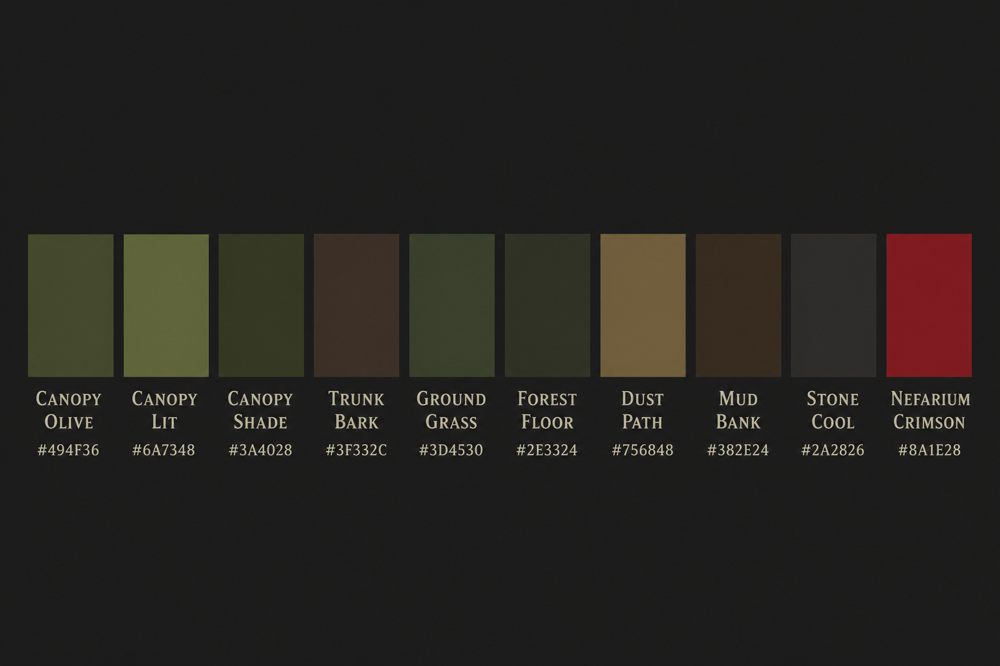

# Theme Palette (Open World Slice)

Status: draft — anchored to the Blockbench `tree.gltf` bake (`tools/art/tree/Tree.bbmodel`) and the vertical-slice forest.

## Intent

Muted dark-fantasy forest that reads with the low-poly tree: warm olive canopy, dusty mauve-brown bark, cooler ground values so trunks and characters stay readable. Saturated color stays reserved for Nefarium / supernatural beats (see [visual-direction.md](visual-direction.md)).

## Core swatches

| Role | Hex | RGB 0–1 | Use |
| --- | --- | --- | --- |
| Canopy Olive | `#494f36` | `0.287, 0.317, 0.212` | Tree foliage average (atlas sample) |
| Canopy Lit | `#6a7348` | `0.416, 0.451, 0.282` | Highlight faces / sunny clearings |
| Canopy Shade | `#3a4028` | `0.227, 0.251, 0.157` | Shadow foliage, dense understory |
| Trunk Bark | `#3f332c` | `0.247, 0.201, 0.175` | Tree trunks, warm timber props |
| Ground Grass | `#3d4530` | `0.239, 0.271, 0.188` | Default terrain / grass paint |
| Forest Floor | `#2e3324` | `0.180, 0.200, 0.141` | Deep under-tree litter |
| Dust Path | `#756848` | `0.459, 0.408, 0.282` | Shore/path sand (muted; avoid cream pops) |
| Mud Bank | `#382e24` | `0.220, 0.180, 0.141` | Wet banks, trail ruts |
| Stone Cool | `#2a2826` | `0.165, 0.157, 0.149` | Rock outcrops |
| Atmosphere Void | `#0a0c12` | `0.039, 0.047, 0.071` | Distant clear color / night void |
| Nefarium Crimson | `#8a1e28` | `0.541, 0.118, 0.157` | Corruption accent (reserved) |
| Nefarium Vein | `#6e8a3a` | `0.431, 0.541, 0.227` | Sickly green energy accent (reserved) |

## Material mapping (sample)

| Asset | Swatch |
| --- | --- |
| `assets/materials/terrain.material.json` | Ground Grass |
| `assets/materials/grass.material.json` | Ground Grass (slightly warmer) |
| `assets/materials/forest_floor.material.json` | Forest Floor |
| `assets/materials/sand_shore.material.json` | Dust Path |
| `assets/materials/mud_shore.material.json` | Mud Bank |
| `assets/materials/stone.material.json` | Stone Cool |
| Foliage layers `grass` / bushes | Canopy Shade → Canopy Olive |

## Rules

1. Ground sits slightly darker/cooler than canopy so tree volumes read.
2. Paths and shores stay warm but desaturated — no bright flax/cream blocks next to olive foliage.
3. Keep value contrast between trunk, canopy, and ground; do not flatten everything to one green.
4. Corruption / magic may break the mute rule; do not use those accents for ordinary biome fill.
5. When rebaking `tree.gltf`, re-sample the atlas and update Canopy / Trunk rows if the art shifts.

## Oak variation concepts

Concept sheets for Blockbench-oak silhouette variants (not yet baked into the scene):

- `oak-variants-concept-sheet.png` — lineup: base, wide, tall, lean, asymmetric
- `oak-silhouette-variants-2x2.png` — wide / tall / lean / asymmetric close-ups
- `oak-young-vs-mature-concept.png` — sapling vs mature comparison

## Open follow-ups

- Sky/fog and sun tint keyed to Atmosphere Void + cool overcast.
- Water material harmonized with Mud Bank / Stone Cool.
- Corrupted ground material slot when Nefarium blight zones are authored.
- Choose oak concept silhouettes to author as Blockbench variants when ready.
