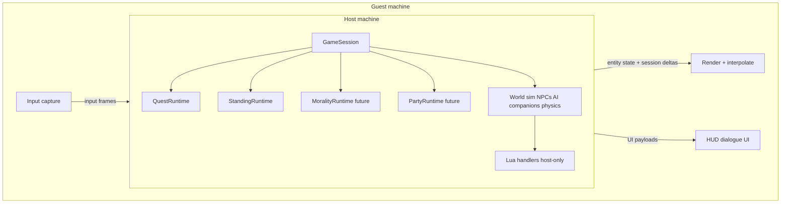
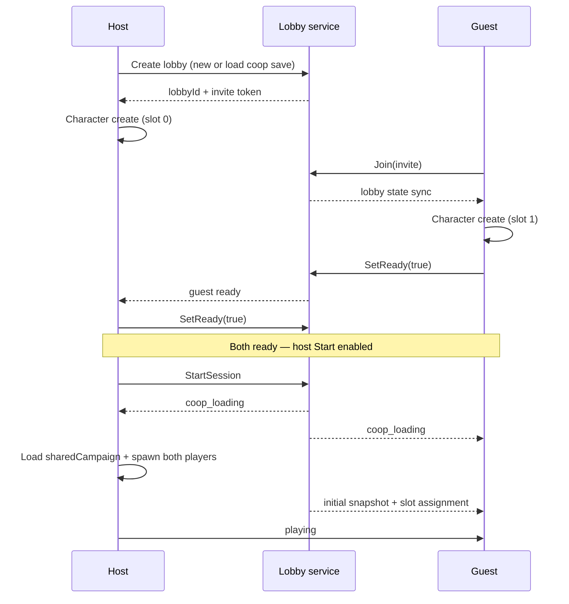

# Co-op Sessions (Online 2-Player)

Status: active (TICKET-0212 GameSession, TICKET-0214 lobby UI shipped; net follow-ons) — product/engine design locked ([DEC-0042](../decisions/index.md#dec-0042-online-co-op-session-model-mode-locked-saves))  
Decision: [DEC-0042](../decisions/index.md#dec-0042-online-co-op-session-model-mode-locked-saves) · Save format: [`../formats/rpg-save.md`](../formats/rpg-save.md) (TICKET-0114)

Single-player remains the primary ship path. Co-op is **online only** (no couch split-screen v1). **Solo and co-op are separate save modes** — a co-op save never falls back to solo play.

## Product summary

| Mode | Humans | Companions (max) | Party cap | Network |
| --- | --- | --- | --- | --- |
| Solo | 1 | 3 | 4 | Offline |
| Co-op | 2 (both required) | 2 | 4 | Host-authoritative online |

**Shared campaign (both modes):** quest progression, faction standing, morality, act/world flags, discovery/fog, camp layout.  
**Per-player:** archetype, appearance, inventory, gear, HUD, input device.

## Runtime ownership



- **Host** is authoritative for simulation, scripts, companions, and all shared runtimes.
- **Guest** sends input and UI confirmations; does not run a second sim or Lua world mutation.
- **Replication:** player transforms/animator/combat state + reliable ordered **session deltas** (quests, standing, morality, flags, discovery). See [Replication phases](#replication-phases).

## Session states

Top-level `GameSession` state machine:

```text
menu
  → solo_loading | coop_lobby
coop_lobby
  → coop_loading        (both ready + host start)
  → menu                  (host cancel / guest leave before start)
coop_loading
  → playing               (both connected)
  → menu                  (load failure)
solo_loading
  → playing
playing
  → paused_waiting_guest  (co-op only: guest disconnect)
  → menu                  (save + quit)
paused_waiting_guest
  → playing               (guest reconnect)
  → menu                  (host end session)
ended
  → menu
```

**Rules**

- Co-op **playing** requires slot 0 (host) and slot 1 (guest) connected.
- **paused_waiting_guest** freezes world sim (untimed). Host may **End session**; never downgrade to solo on the same save.
- Solo **playing** never enters lobby or guest wait states.

## Engine API (TICKET-0212)

C++ type: `engine::GameSession` (`include/engine/session/game_session.h`).

| Method | Effect |
| --- | --- |
| `begin_solo()` | Menu/Ended → `solo_loading`; host slot connected |
| `begin_coop_lobby()` | Menu/Ended → `coop_lobby` |
| `set_slot_connected(slot, connected, device_index)` | Slot 0/1; guest disconnect while playing → `paused_waiting_guest` |
| `set_ready(slot, ready)` / `is_ready` / `can_host_start()` | Lobby ready gate (TICKET-0214); Start requires both connected + ready |
| `invite_code()` / `mock_guest_join(code)` | Local mock invite (default `COOP-LOCAL`); real join = TICKET-0215 |
| `enter_coop_loading()` / `start_playing()` | Fail closed with `GAME-SESSION-COOP-NEEDS-GUEST` if guest absent |
| `resume_after_guest_reconnect()` | `paused_waiting_guest` → `playing` when guest connected |
| `end_session()` | → `ended` **without** changing `sessionMode` to solo |
| `simulation_allowed()` | true only in `playing` (freezes quest/standing/Lua tick consumers when false) |
| `bind_quest_runtime` / `bind_standing_runtime` | Shared session-owned pointers |

**Error codes:** `GAME-SESSION-COOP-NEEDS-GUEST`, `GAME-SESSION-SOLO-NO-GUEST`, `GAME-SESSION-INVALID-STATE`, `GAME-SESSION-INVALID-SLOT`, `GAME-SESSION-HOST-REQUIRED`, `GAME-SESSION-NOT-CONNECTED`, `GAME-SESSION-BAD-INVITE`.

**Camera leash:** `CameraLeashMode::Midpoint` (orbit pivot = midpoint of host + guest feet).

**Local prove-out:** `engine editor --project samples/open-world-rpg --coop-local` — F5 starts dual-slot session (WASD host, arrow keys guest; F8 guest disconnect pause; F9 resume). Suite: `game_session`.

**MCP agent prove-out:** `engine_coop_call` (`status` / `start_local` / `possess` / `move` / `jump` / `disconnect_guest` / `reconnect_guest` / `end`). Movement injects a camera-relative wish for N frames (does not require physical WASD). See [`mcp-live-editor.md`](mcp-live-editor.md).

## Lobby UI (TICKET-0214)

Sample canvases under `samples/open-world-rpg/assets/ui/`:

| Canvas id | File | Role |
| --- | --- | --- |
| `coop_lobby_host` | `coop_lobby_host.uicanvas.json` | Invite display + **Simulate Guest Join** |
| `coop_lobby_join` | `coop_lobby_join.uicanvas.json` | Guest join (local mock accepts `COOP-LOCAL`) |
| `coop_ready_room` | `coop_ready_room.uicanvas.json` | Per-slot Ready + host Start |
| `coop_reconnect` | `coop_reconnect.uicanvas.json` | `paused_waiting_guest` overlay + End session |

Main menu adds **Co-op** (`main_menu.coop`). Handlers: `assets/scripts/ui_handlers.lua`.

**Lua (`engine.*`):** `coop_begin_host_lobby`, `coop_mock_guest_join`, `coop_set_ready`, `coop_toggle_ready`, `coop_host_start`, `coop_end_session`, `coop_can_host_start`, `coop_invite_code`, plus `ui_canvas_set_enabled` / `ui_canvas_set_text`.

**Editor bridge:** Start sets blackboard `coop.request_play_test` → enables `coop_local` and (re)starts F5 dual-slot. Disconnect pause auto-pushes `coop_reconnect`; End Session sets `coop.request_end_test`.

**Desktop QA:** Esc → Main Menu → Co-op → Simulate Guest Join → Ready both → Start → play; **WASD + look** possess the focused avatar; **F7** swap host ↔ guest (camera + control); F8 → reconnect overlay → End Session.

## Lobby UX flow (co-op only)

### Screens

| Screen | Who | Purpose |
| --- | --- | --- |
| Main menu → **Co-op** | Host | New co-op game or load co-op save |
| **Host lobby** | Host | Invite code / friends join; difficulty; host character create |
| **Join lobby** | Guest | Enter invite / pick host session |
| **Lobby ready room** | Both | Character create/edit; ready toggle; chat optional |
| **Loading** | Both | Progress bar; host loads save + world |
| **Playing** | Both | Shared campaign |
| **Reconnect overlay** | Both | Guest disconnect banner; host **End session** button |

Solo path skips lobby: Main menu → **Solo** → New/Load → character create (if new) → loading → playing.

### Lobby ready room (detailed)



**UI elements (ready room)**

| Element | Host | Guest |
| --- | --- | --- |
| Character panel (archetype, appearance) | Edit before ready | Edit before ready |
| Ready toggle | Yes | Yes |
| Start button | Enabled when **both** ready | Hidden |
| Leave lobby | Returns to menu | Returns to menu |
| Save name / act summary (load) | Read-only | Read-only |

**Start gate:** `host.ready && guest.ready && guest.connected` → host may press **Start**.

**Character creation in lobby:** each player configures their own slot (`hostProfile` / `guestProfile` in save). Archetype set per [DEC-0009](../decisions/index.md#dec-0009-starting-archetype-character-creation). Shared morality/standing start from save or new-game defaults in `sharedCampaign`.

## In-session co-op rules

### Party (`PartyRuntime`)

- Active companion ids stored in `sharedCampaign.party` (see save format).
- Recruitment blocked when `activeCompanions.length >= maxCompanionsForMode`.
- Companion follow AI runs on host; guest sees replicated transforms.

### Major story forks (unanimous)

Both players must confirm before apply:

| Category | Examples |
| --- | --- |
| Allegiance | Faction lock-in (`StandingRuntime::lock_in_faction` threshold choice) |
| Act transitions | Soft-gate unlocks tagged `requiresUnanimous` in World Forge |
| High-impact quest forks | Main-quest forks with `consequential: true` |
| Camp / travel (co-op) | Fast travel gold spend at post; enter camp instance from overland |

**UI pattern:** modal with choice summary → **Confirm** on each client → host applies only when both confirms received (host discards stale partial confirms on choice change).

Dialogue that only affects local barks does not require unanimous confirm unless it triggers a shared fork.

### Guest disconnect

1. Host detects guest link loss → `playing` → `paused_waiting_guest`.
2. Overlay: “Waiting for partner…” + host **End session**.
3. Guest reconnects with same invite/save slot → host sends snapshot → `playing`.
4. Host **End session** → atomic save at last checkpoint → both to menu. Co-op save remains loadable only with two players.

## Replication phases

Implement in order. Each phase should be testable in isolation before the next.

| Phase | Ship target | Host → guest | Guest → host | Notes |
| --- | --- | --- | --- | --- |
| **R0 — Session handshake** | Lobby + slot assign | lobby state, save hash, `playerSlot` | join, ready, leave | No world sim yet |
| **R1 — Player bodies** | Two avatars in world | transform, yaw, animator state hash, health | movement/combat input frames | Host simulates both capsules |
| **R2 — Reliable session deltas** | Shared progression | quest/standing/morality/flag/discovery patches | `fork_confirm` events | Ordered channel; apply on guest for UI only |
| **R3 — Interaction sync** | Dialogue + interact | dialogue UI payload, interaction locks | interact request, choice index, unanimous confirm | Host validates range + stage |
| **R4 — Combat + AI** | Companions + enemies | NPC/companion state snapshots | attack/target input | Host-only AI; guest prediction optional later |
| **R5 — Instances + streaming** | Camp, rare instances | instance id, anchor transform, load token | ready-for-instance | Align with DEC-0021 / DEC-0033 |
| **R6 — Reconnect snapshot** | Untimed pause resume | full `sharedCampaign` + both profiles + entity snapshot | reconnect token | Idempotent resume |

**Do not replicate:** Lua blackboard wholesale, terrain/cell payloads, full scene JSON, editor state.

**Transport (open):** Steam Networking, EOS, or custom UDP — not chosen in DEC-0042. R0–R6 assume a reliable-ordered + unreliable channel abstraction.

## Implementation dependency order

Aligns with DEC-0042. Epic **EPIC-0017** in [`epics.md`](../planning/epics.md). SP can ship through step 3; steps 4–6 are co-op ship.

| Step | Ticket | Deliverable |
| --- | --- | --- |
| 1 | **TICKET-0212** | `GameSession` + mode fork + local dual-slot play test |
| 2 | **TICKET-0114** | Save load/save — [`rpg-save.md`](../formats/rpg-save.md); refuse invalid mode |
| 3 | **TICKET-0213** | `PartyRuntime` — companion caps by mode |
| 4 | **TICKET-0214** | Lobby UI canvases (mock guest until R0) |
| 5 | **TICKET-0215** | Online R0 — lobby handshake |
| 6 | **TICKET-0216** | Online R1 — player body replication |
| 7 | **TICKET-0217** | R2 + unanimous fork UI (proposed) |
| 8 | **TICKET-0218** | R6 reconnect snapshot (proposed) |

## Related systems

| System | Co-op note |
| --- | --- |
| Quest ([DEC-0028](../decisions/index.md#dec-0028-explicit-quest-progression-runtime)) | Host-only `complete_objective`; guest UI mirrors via R2 |
| Standing ([DEC-0029](../decisions/index.md#dec-0029-continuous-faction-standing-with-hostility-transfer)) | Host-only `adjust`; shared scores in save |
| Camp ([DEC-0033](../decisions/index.md#dec-0033-anywhere-player-camp-as-editable-instance-dao-style)) | Both humans required to enter/exit co-op camp |
| Fast travel ([DEC-0032](../decisions/index.md#dec-0032-open-world-travel-discovery-map-and-dual-soft-gates)) | Unanimous confirm for co-op FT spend |
| UI canvas ([DEC-0025](../decisions/index.md#dec-0025-responsive-ui-canvas-stack-editor--mcp)) | Lobby, ready room, reconnect overlay, fork modal canvases |

## Out of scope (v1 co-op)

- Couch / split-screen
- Solo ↔ co-op save conversion
- More than two human players
- Guest continuing co-op save alone
- Player save cloud sync (distinct from authoring git sync)
